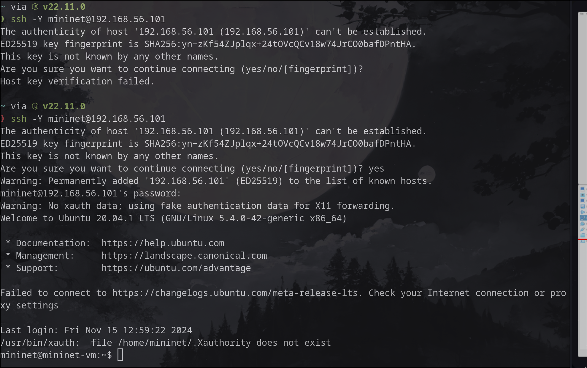
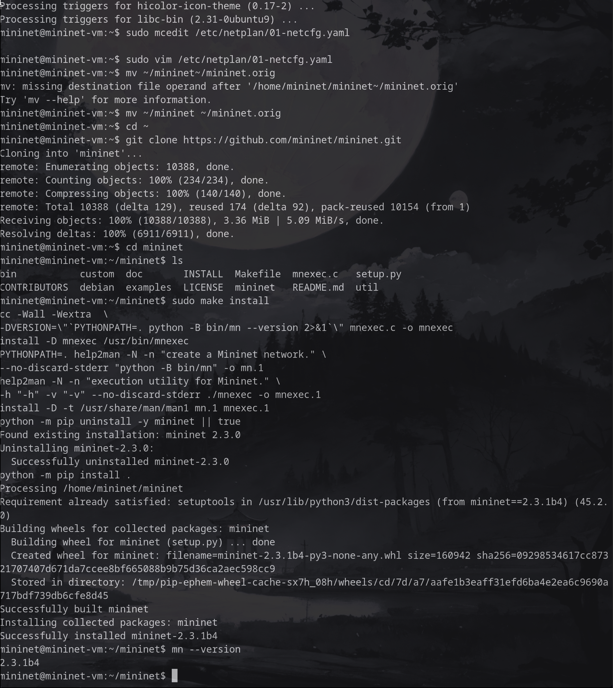
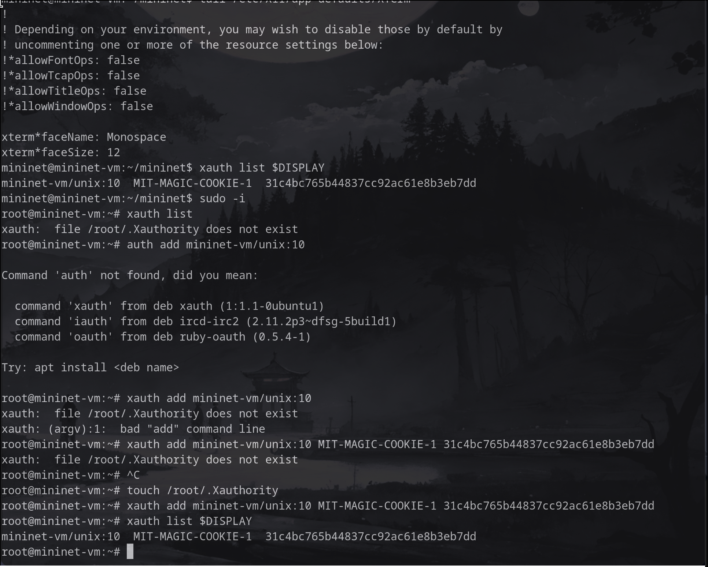
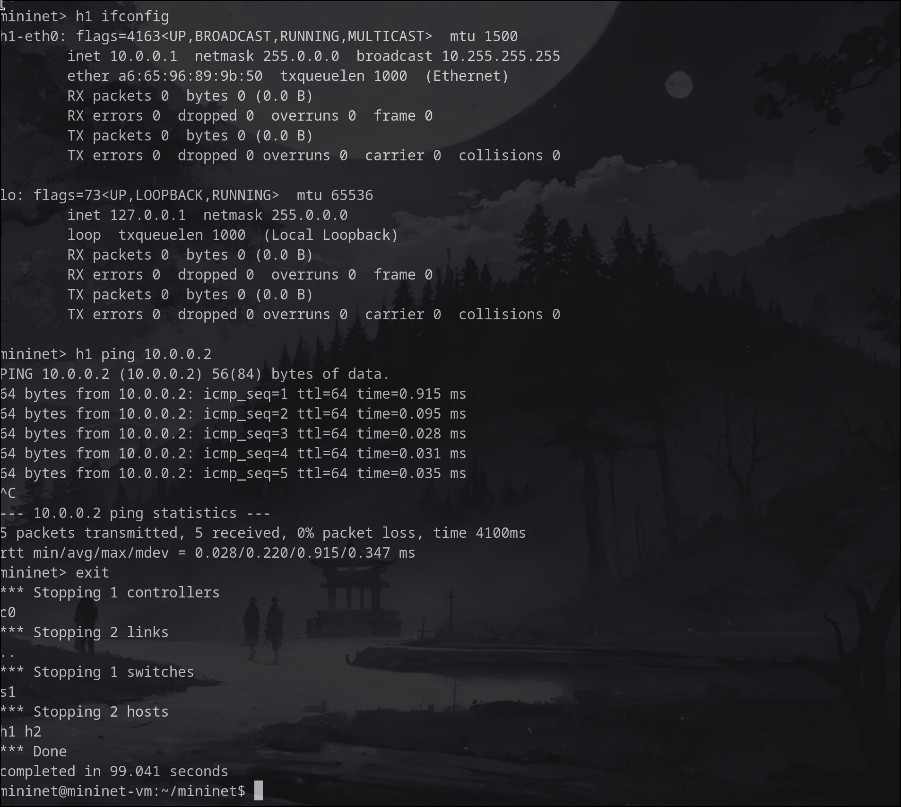
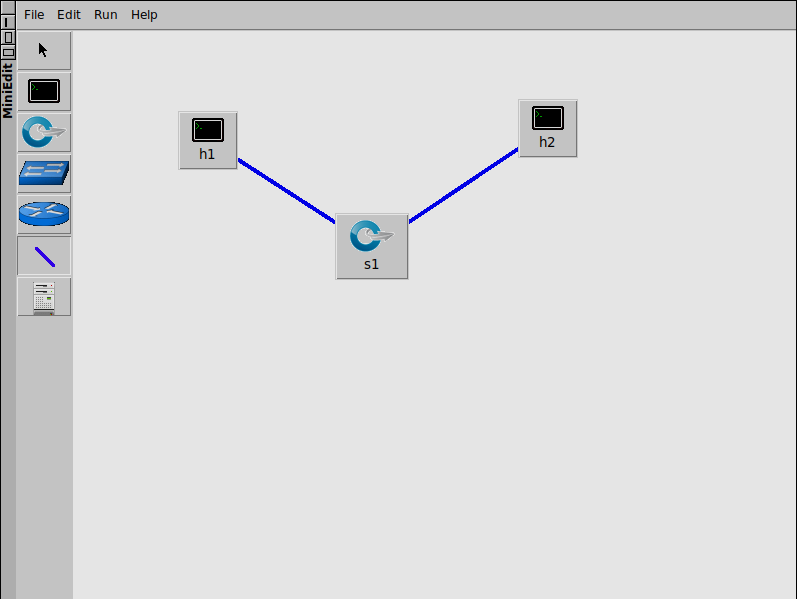

---
# Лабораторнаяя работа №1. Введение в Mininet
## Автор: Старовойтов Егор Сергеевич НПИбд-02-21

# Цель работы
Основной целью работы является развёртывание в системе виртуализации
(например, в VirtualBox) mininet, знакомство с основными командами для рабо-
ты с Mininet через командную строку и через графический интерфейс.

# Теоретическое введение
Mininet (http://mininet.org/) — это виртуальная среда, которая позволяет
разрабатывать и тестировать сетевые инструменты и протоколы. В сетях Mininet
работают реальные сетевые приложения Unix/Linux, а также реальное ядро Linux
и сетевой стек.

# Выполнение лабораторной работы

## 1. Настройка и первый запуск VM Mininet.

## 2. Подключение к VM по ssh 

## 3. Настройка сети.

## 4. Настройка 01-netcfg.yaml

## 5. Обновление Mininet

## 6. Настройка xterm

## 7. Основы работы c Mininet

## 8. Проверка связности

## 9. Топология сети

## 10. ifconfig на хостах

## 11. ifconfig на h1 после автоматического назначения айпи адресов

## 12. Сохранение работы

# Выводы
Я успешно развернул mininet в среде виртуализации VirtualBox и познакомился с основными командами работы с Mininet через командную оболочку и графический интерфейс.

