---
## Front matter
title: "Лабораторнаяя работа №1. Введение в Mininet"
author: "Старовойтов Егор Сергеевич"

## Generic otions
lang: ru-RU
toc-title: "Содержание"

<!--## Bibliography-->
<!--bibliography: bib/cite.bib-->
<!--csl: pandoc/csl/gost-r-7-0-5-2008-numeric.csl-->
<!---->
<!--## Pdf output format-->
<!--toc: true # Table of contents-->
<!--toc-depth: 2-->
<!--lof: true # List of figures-->
<!--lot: true # List of tables-->
<!--fontsize: 12pt-->
<!--linestretch: 1.5-->
<!--papersize: a4-->
<!--documentclass: scrreprt-->
<!--## I18n polyglossia-->
<!--polyglossia-lang:-->
<!--  name: russian-->
<!--  options:-->
<!--	- spelling=modern-->
<!--	- babelshorthands=true-->
<!--polyglossia-otherlangs:-->
<!--  name: english-->
<!--## I18n babel-->
<!--babel-lang: russian-->
<!--babel-otherlangs: english-->
<!--## Fonts-->
<!--mainfont: IBM Plex Serif-->
<!--romanfont: IBM Plex Serif-->
<!--sansfont: IBM Plex Sans-->
<!--monofont: IBM Plex Mono-->
<!--mathfont: STIX Two Math-->
<!--mainfontoptions: Ligatures=Common,Ligatures=TeX,Scale=0.94-->
<!--romanfontoptions: Ligatures=Common,Ligatures=TeX,Scale=0.94-->
<!--sansfontoptions: Ligatures=Common,Ligatures=TeX,Scale=MatchLowercase,Scale=0.94-->
<!--monofontoptions: Scale=MatchLowercase,Scale=0.94,FakeStretch=0.9-->
<!--mathfontoptions:-->
<!--## Biblatex-->
<!--biblatex: true-->
<!--biblio-style: "gost-numeric"-->
<!--biblatexoptions:-->
<!--  - parentracker=true-->
<!--  - backend=biber-->
<!--  - hyperref=auto-->
<!--  - language=auto-->
<!--  - autolang=other*-->
<!--  - citestyle=gost-numeric-->
<!--## Pandoc-crossref LaTeX customization-->
<!--figureTitle: "Рис."-->
<!--tableTitle: "Таблица"-->
<!--listingTitle: "Листинг"-->
<!--lofTitle: "Список иллюстраций"-->
<!--lotTitle: "Список таблиц"-->
<!--lolTitle: "Листинги"-->
<!--## Misc options-->
<!--indent: true-->
<!--header-includes:-->
<!--  - \usepackage{indentfirst}-->
<!--  - \usepackage{float} # keep figures where there are in the text-->
<!--  - \floatplacement{figure}{H} # keep figures where there are in the text-->
<!------->

# Цель работы
Основной целью работы является развёртывание в системе виртуализации
(например, в VirtualBox) mininet, знакомство с основными командами для рабо-
ты с Mininet через командную строку и через графический интерфейс.

# Теоретическое введение
Mininet (http://mininet.org/) — это виртуальная среда, которая позволяет
разрабатывать и тестировать сетевые инструменты и протоколы. В сетях Mininet
работают реальные сетевые приложения Unix/Linux, а также реальное ядро Linux
и сетевой стек.

# Выполнение лабораторной работы

## 1. Настройка и первый запуск VM Mininet.
Помимо очевидных действий пришлось добавить видеопамяти виртуальной машине и настроить сетевой адаптер в параметров VirtualBox.

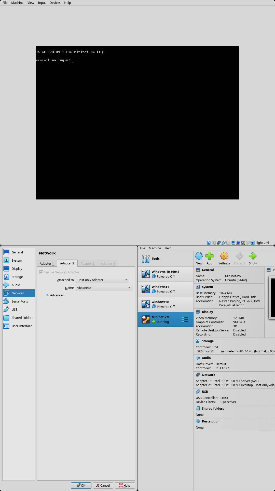

## 2. Подключение к VM по ssh 
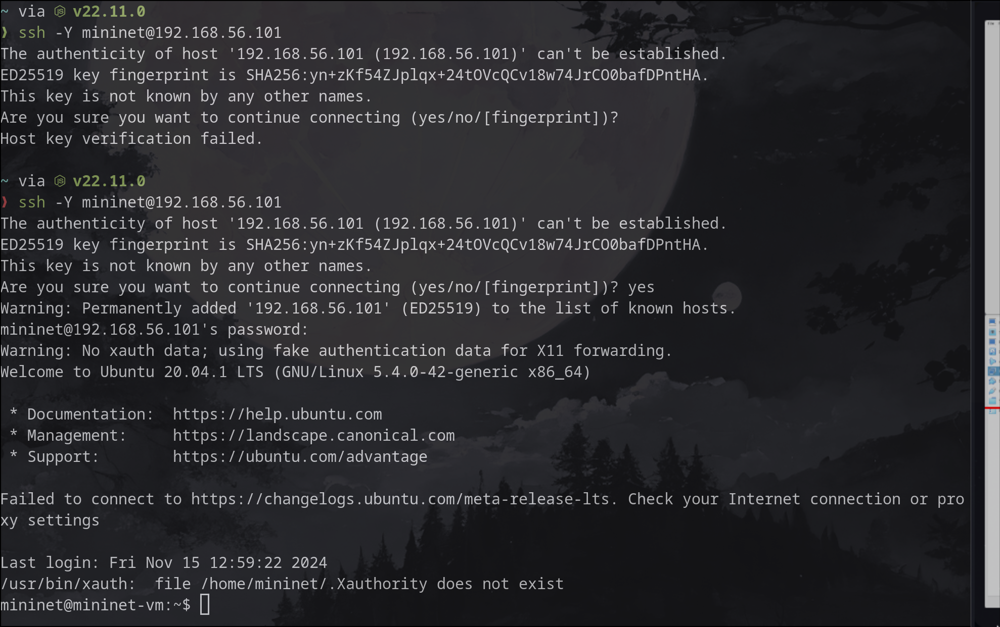

## 3. Настройка сети.
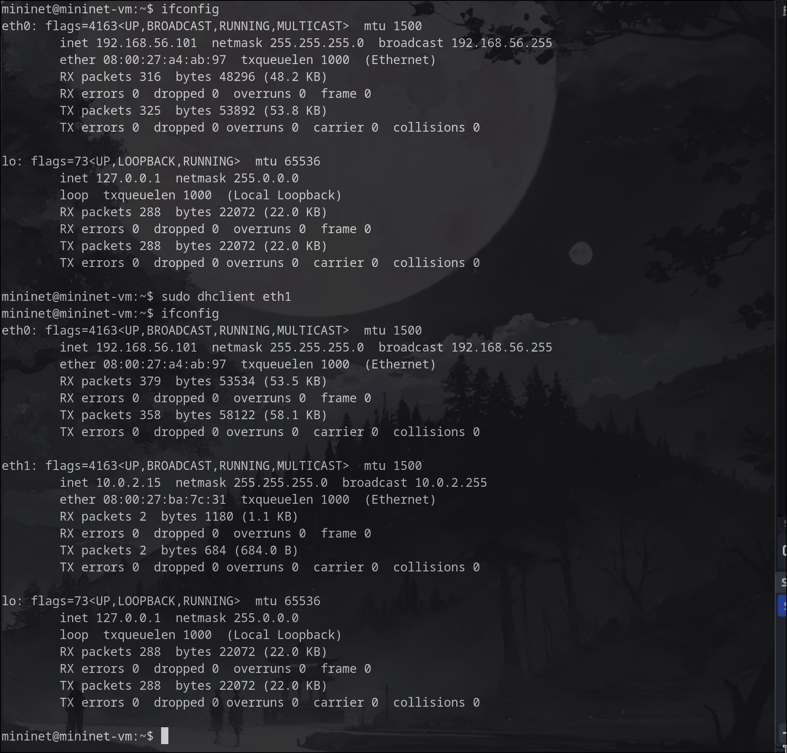

## 4. Настройка 01-netcfg.yaml
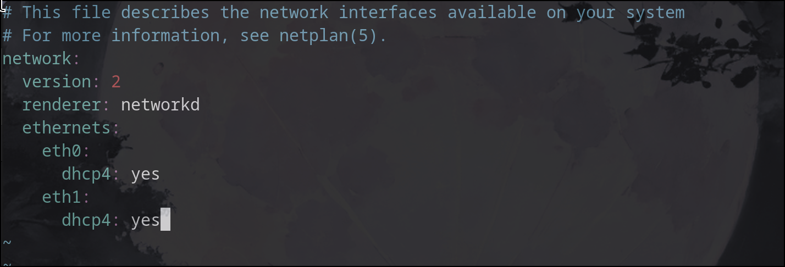

## 5. Обновление Mininet
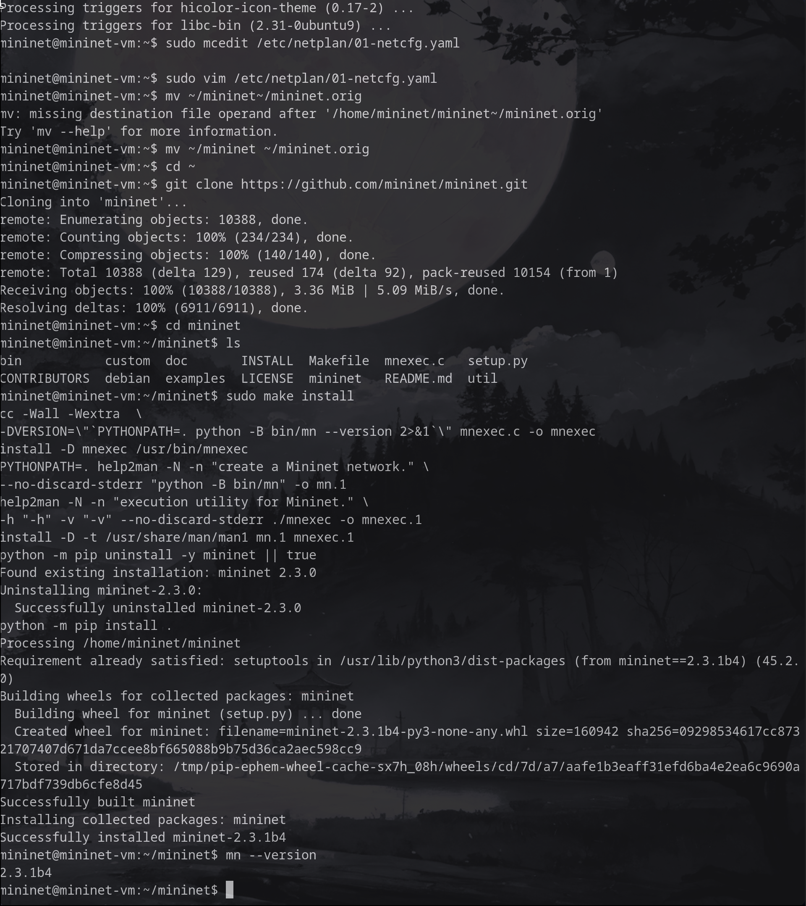

## 6. Настройка xterm
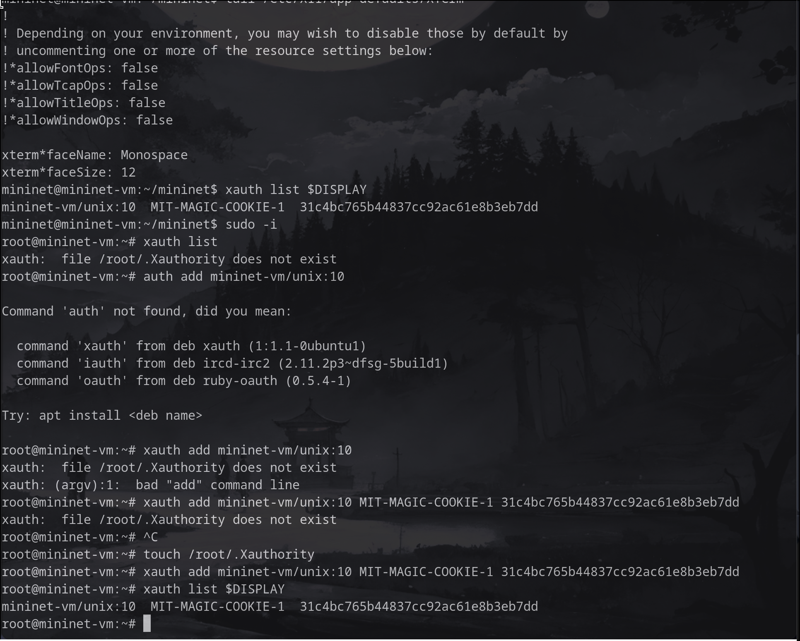

## 7. Основы работы c Mininet
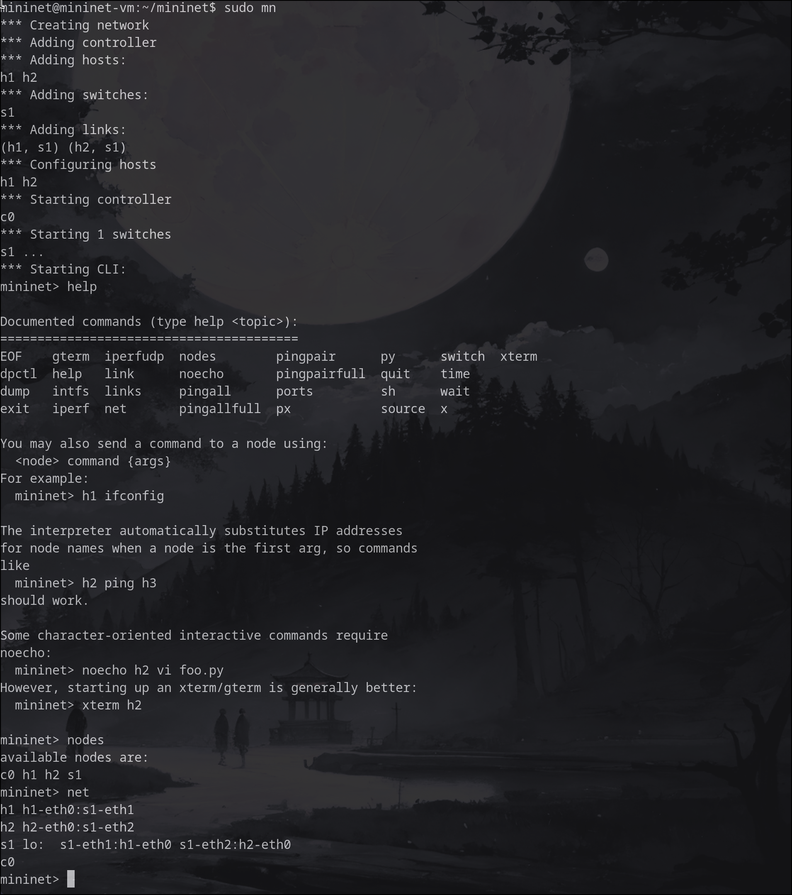

## 8. Проверка связности
Предварительно пришлось повозиться и установить+настроить, чтобы иметь возможность запускать графические приложения.

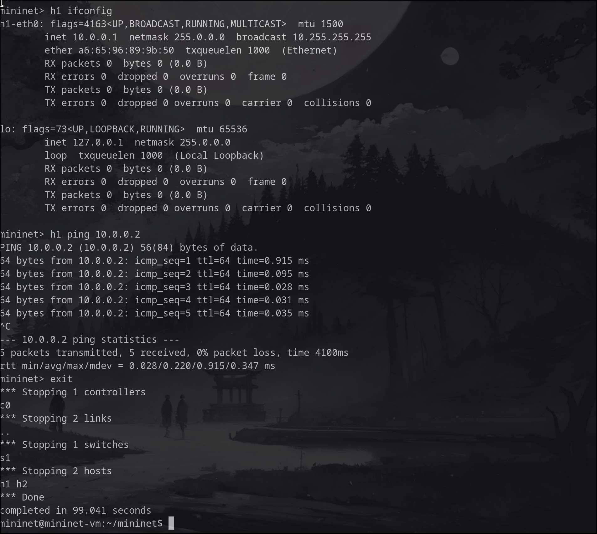

## 9. Топология сети

## 10. ifconfig на хостах
Приведу скриншот для хоста "h1", "h2" выглядит по аналогии.

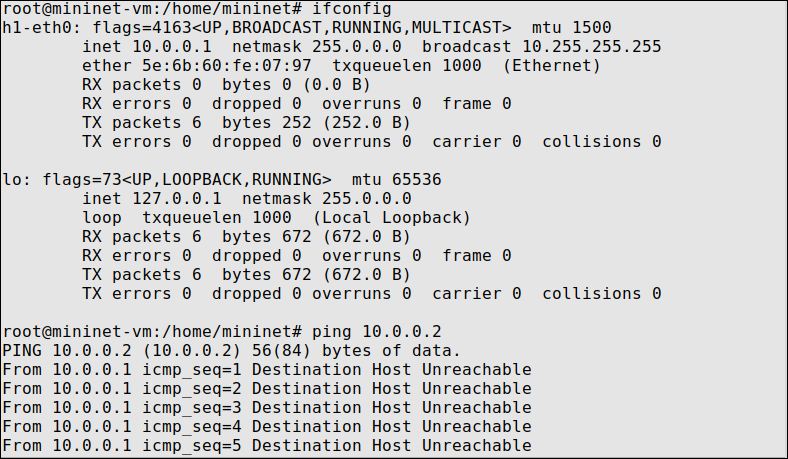

## 11. ifconfig на h1 после автоматического назначения айпи адресов
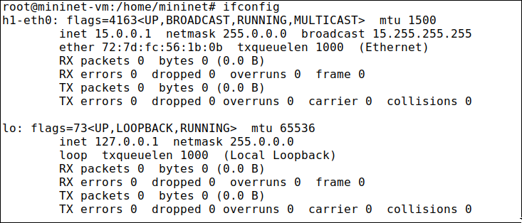

## 12. Сохранение работы
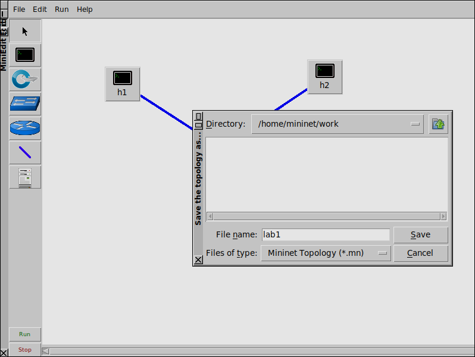

# Выводы
Я успешно развернул mininet в среде виртуализации VirtualBox и познакомился с основными командами работы с Mininet через командную оболочку и графический интерфейс.

