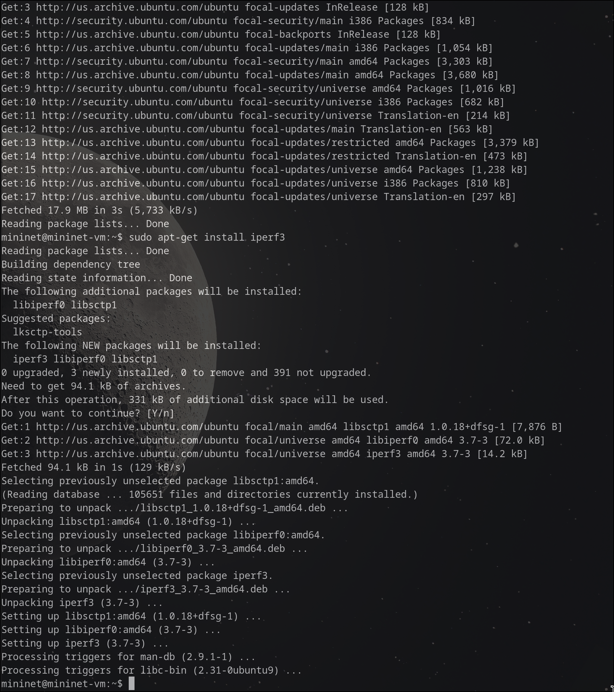
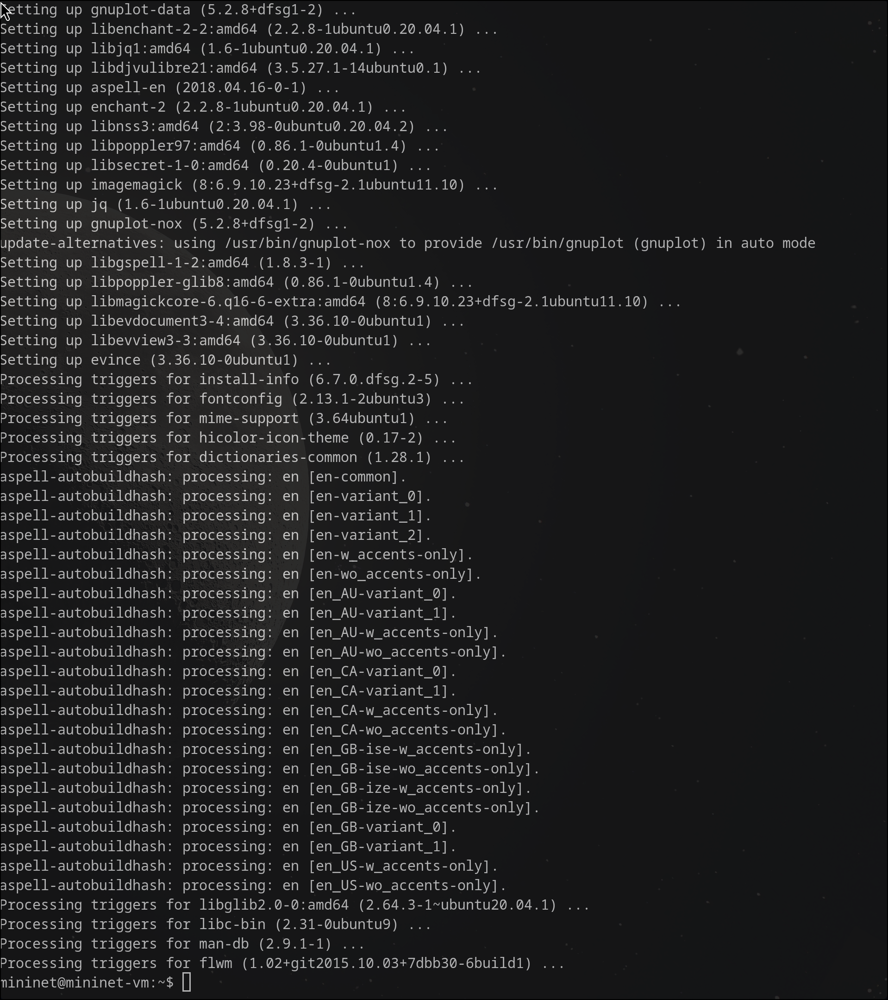
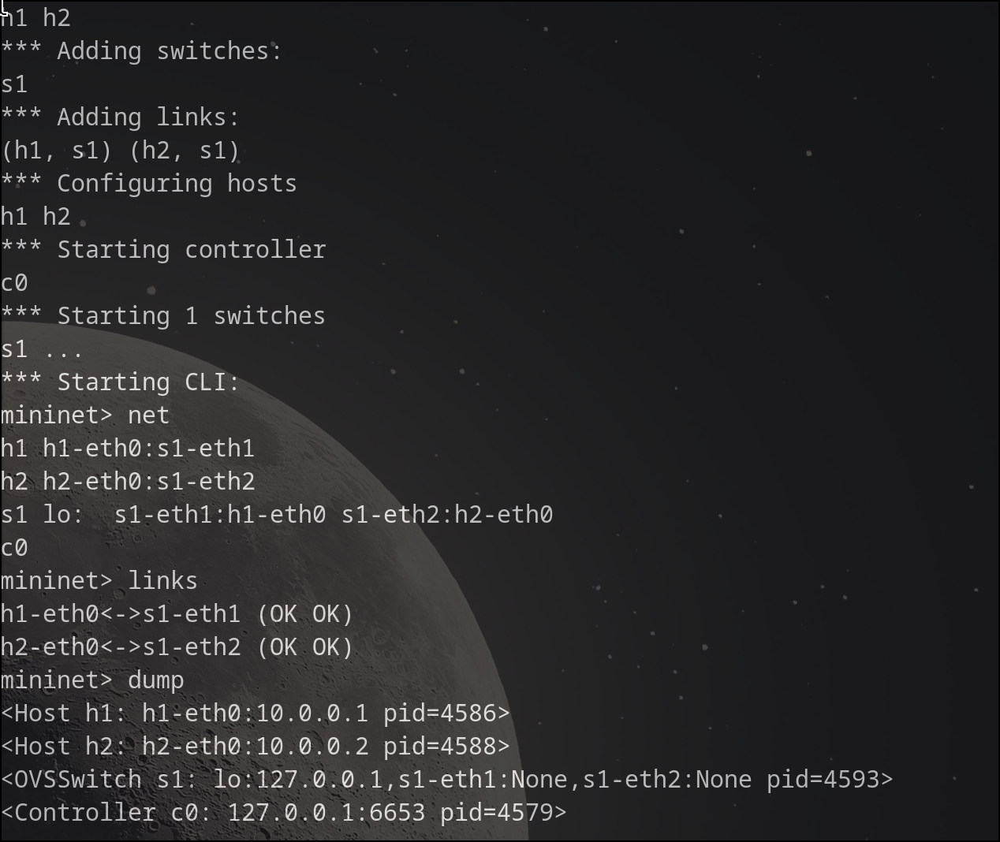
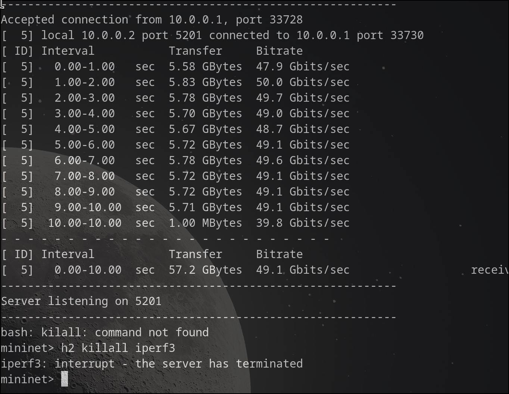
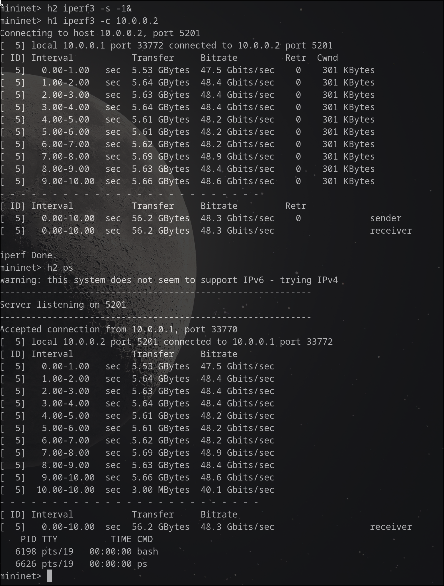
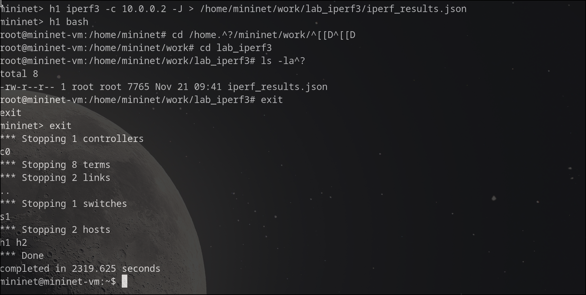
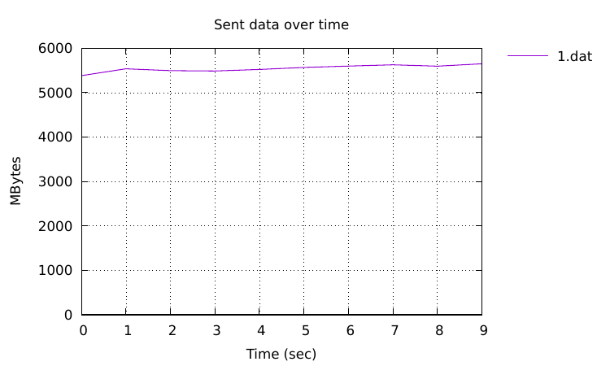
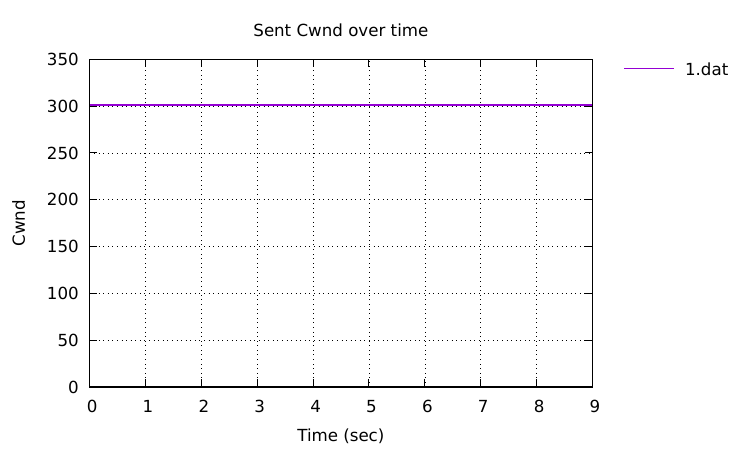

---
## Front matter
lang: ru-RU
title: Лабораторная работа № 2
subtitle: Измерение и тестирование пропускной способности сети. Интерактивный эксперимент
author:
  - Старовойтов Е. С.
institute:
  - Российский университет дружбы народов, Москва, Россия
date: 21 ноября 2024

## i18n babel
babel-lang: russian
babel-otherlangs: english

## Formatting pdf
toc: false
toc-title: Содержание
slide_level: 2
aspectratio: 169
section-titles: true
theme: metropolis
header-includes:
 - \metroset{progressbar=frametitle,sectionpage=progressbar,numbering=fraction}
---

# Информация

## Докладчик

  * Старовойтов Егор Сергеевич 
  * студент кафедры ТВиК
  * Российский университет дружбы народов
  * [1032212281@pfur.ru](mailto:1032212281@pfur.ru)


# Вводная часть

## Цели и задачи
Основной целью работы является знакомство с инструментом для измерения
пропускной способности сети в режиме реального времени — iPerf3, а также
получение навыков проведения интерактивного эксперимента по измерению
пропускной способности моделируемой сети в среде Mininet.

Задачи:
1. Установить на виртуальную машину mininet iPerf3 и дополнительное про-
граммное обеспечения для визуализации и обработки данных.
2. Провести ряд интерактивных экспериментов по измерению пропускной
способности с помощью iPerf3 с построением графиков.


## Результаты
Поставленные боевые задачи были выполнены, все цели достигнуты.

# Выполнение работы

### 1. Подключение, просмотр адресов, обновление пакетов 


### 2. Установка iperf


### 3. Устанвока дополнительного ПО


### 4. Развертка iperf3_plotter


### 5. Параметры запущенной топологии


### 6. Запуск сервера iPerf3 в терминале h2 
Запуск осуществлялся командой
```bash 
iperf3 -s on h2
```


### 7. Тест соединения с терминала h1 


### 8. Эксперимент с прерыванеим (командой "killall")


### 9. Тест пропускной способности с интервалом 2 сек


### 10. Тест с объемом данных 16G


### 11. Тест UDP


### 12. Тест с портом -p 3250


### 13. Тест с опцией -1. 
Действительно видно, что сервер останавливается после теста первого и единственного соединения.



### 14. Вывод результатов теста в Json


### 15. Экспорт результатов теста в Json файл в рабочем каталоге


### 16. Визуализация графиков







# Выводы
Я ознакомился с инструментом для измерения
пропускной способности сети в режиме реального времени — iPerf3, а также
получил навыки проведения интерактивного эксперимента по измерению
пропускной способности моделируемой сети в среде Mininet.

В процессе выполнения работы были решены поставленные задачи, а именно:
1. iPerf3 и дополнительное ПО было установлено на виртуальную машину с mininet.
2. Был проведен ряд интерактивных экспериментов по измерению пропускной способности; были построены графики.


