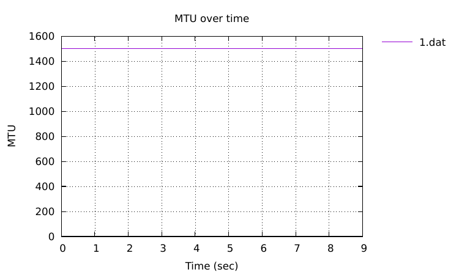

---
## Front matter
lang: ru-RU
title: Лабораторная работа № 3
subtitle: "Измерение и тестирование пропускной способности сети. Воспроизводимый эксперимент" 
author:
  - Старовойтов Е. С.
institute:
  - Российский университет дружбы народов, Москва, Россия
date: 25 ноября 2024

## i18n babel
babel-lang: russian
babel-otherlangs: english

## Formatting pdf
toc: false
toc-title: Содержание
slide_level: 2
aspectratio: 169
section-titles: true
theme: metropolis
header-includes:
 - \metroset{progressbar=frametitle,sectionpage=progressbar,numbering=fraction}
---

# Информация

## Докладчик

  * Старовойтов Егор Сергеевич 
  * студент кафедры ТВиК
  * Российский университет дружбы народов
  * [1032212281@pfur.ru](mailto:1032212281@pfur.ru)

# Вводная часть

## Цели и задачи
Основной целью работы является знакомство с инструментом для измерения
пропускной способности сети в режиме реального времени — iPerf3, а также
получение навыков проведения воспроизводимого эксперимента по измерению
пропускной способности моделируемой сети в среде Mininet.

Задачи:
1. Воспроизвести посредством API Mininet эксперименты по измерению про-
пускной способности с помощью iPerf3.
2. Построить графики по проведённому эксперименту

## Результаты
Поставленные боевые задачи были выполнены, все цели достигнуты.

## 1. Создание файла скрипта

## 2. Запуск скрипта создания топологии

## 3. Вывод информации о хосте h1 

## 4. Проверка работы скрипта

## 5. Вывод информации о втором хосте

## 6. Настройки параметров производительности

 

## 7. Сравнение работы двух скриптов

## 8. Создание копии `lab_iperf3_topo2.py`

## 9. Модификация `lab_iperf3.py` 

## 10. Запуск iperf3 и построение графиков

## 12. Создание и проверка Makefile

# Выполнение работы
### 16. Визуализация графиков

# Выводы

Я познакомился с инструментом для измерения пропускной способности сети в режиме 
реального времени — iPerf3, а также получил навыки проведения воспроизводимого 
эксперимента по измерению пропускной способности моделируемой сети в среде Mininet.

В процессе выполнения работы были решены поставленные задачи, а именно:
1. Воспроизвести посредством API Mininet эксперименты по измерению про-
пускной способности с помощью iPerf3.
2. Построить графики по проведённому эксперименту
