---
## Front matter
title: "Лабораторная работа № 3"
subtitle: "Измерение и тестирование пропускной способности сети. Воспроизводимый эксперимент" 
author: "Старовойтов Егор Сергеевич"

## Generic otions
lang: ru-RU
toc-title: "Содержание"

## Bibliography
bibliography: bib/cite.bib
csl: pandoc/csl/gost-r-7-0-5-2008-numeric.csl

## Pdf output format
toc: true # Table of contents
toc-depth: 2
lof: true # List of figures
lot: true # List of tables
fontsize: 12pt
linestretch: 1.5
papersize: a4
documentclass: scrreprt
## I18n polyglossia
polyglossia-lang:
  name: russian
  options:
	- spelling=modern
	- babelshorthands=true
polyglossia-otherlangs:
  name: english
## I18n babel
babel-lang: russian
babel-otherlangs: english
## Fonts
mainfont: IBM Plex Serif
romanfont: IBM Plex Serif
sansfont: IBM Plex Sans
monofont: IBM Plex Mono
mathfont: STIX Two Math
mainfontoptions: Ligatures=Common,Ligatures=TeX,Scale=0.94
romanfontoptions: Ligatures=Common,Ligatures=TeX,Scale=0.94
sansfontoptions: Ligatures=Common,Ligatures=TeX,Scale=MatchLowercase,Scale=0.94
monofontoptions: Scale=MatchLowercase,Scale=0.94,FakeStretch=0.9
mathfontoptions:
## Biblatex
biblatex: true
biblio-style: "gost-numeric"
biblatexoptions:
  - parentracker=true
  - backend=biber
  - hyperref=auto
  - language=auto
  - autolang=other*
  - citestyle=gost-numeric
## Pandoc-crossref LaTeX customization
figureTitle: "Рис."
tableTitle: "Таблица"
listingTitle: "Листинг"
lofTitle: "Список иллюстраций"
lotTitle: "Список таблиц"
lolTitle: "Листинги"
## Misc options
indent: true
header-includes:
  - \usepackage{indentfirst}
  - \usepackage{float} # keep figures where there are in the text
  - \floatplacement{figure}{H} # keep figures where there are in the text
---

# Цель работы
Основной целью работы является знакомство с инструментом для измерения
пропускной способности сети в режиме реального времени — iPerf3, а также
получение навыков проведения воспроизводимого эксперимента по измерению
пропускной способности моделируемой сети в среде Mininet.

# Задание
1. Воспроизвести посредством API Mininet эксперименты по измерению про-
пускной способности с помощью iPerf3.
2. Построить графики по проведённому эксперименту

# Теоретическое введение
Application Programming Interface (API) — программный интерфейс прило-
жения, или интерфейс программирования приложений) представляет собой
специальный протокол для взаимодействия компьютерных программ, который
позволяет использовать функции одного приложения внутри другого.
API Mininet построен на трех основных уровнях:
– Низкоуровневый API состоит из базовых узлов и классов ссылок (таких как
Host, Switch, Link и их подклассы), которые на самом деле могут быть
созданы по отдельности и использоваться для создания сети, но это немного
громоздко.
– API среднего уровня добавляет объект Mininet, который служит контейнером
для узлов и ссылок. Он предоставляет ряд методов (addHost(), addSwitch(),
addLink()) для добавления узлов и ссылок в сеть, а также настройки сети,
запуска и завершения работы (start(), stop()).
– Высокоуровневый API добавляет абстракцию шаблона топологии (класс Topo),
который предоставляет возможность создавать повторно используемые пара-
метризованные шаблоны топологии. Эти шаблоны можно передать команде
mn (через параметр --custom) и использовать из командной строки.
Низкоуровневый API используется, когда требуется управлять узлами и ком-
мутаторами напрямую. API среднего уровня применяют при запуске и остановке
сети (в частности используется класс Mininet).
Полноценные сети могут быть созданы с использованием любого из уров-
ней API, но обычно для создания сетей выбирают либо API среднего уровня
(например, Mininet.add*()), либо API высокого уровня (Topo. add*())

# Выполнение лабораторной работы
## 1. Создание файла скрипта
В каталоге `/work/lab_iperf3` для работы над проектом я создал под-
каталог `lab_iperf3_topo` и скопировал в него файл с примером скрипта
`mininet/examples/emptynet.py`, описывающий стандартную простую
топологию сети mininet.

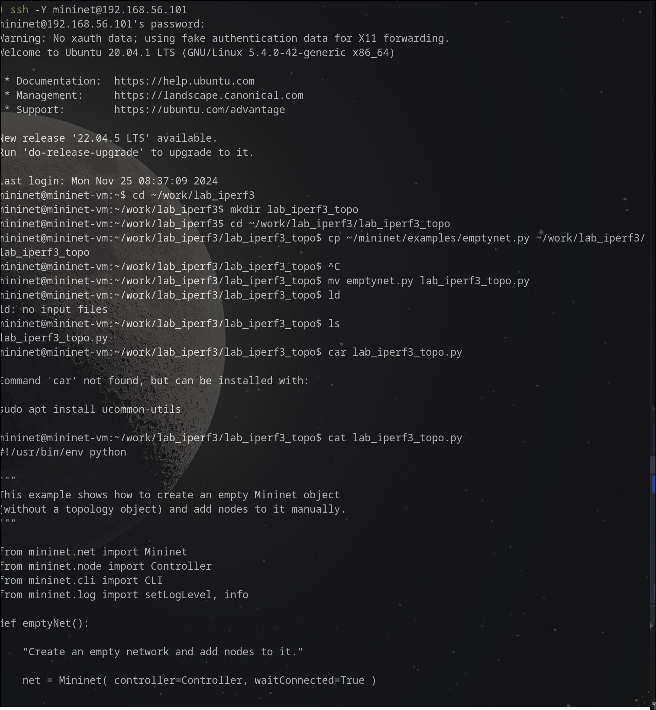

## 2. Запуск скрипта создания топологии

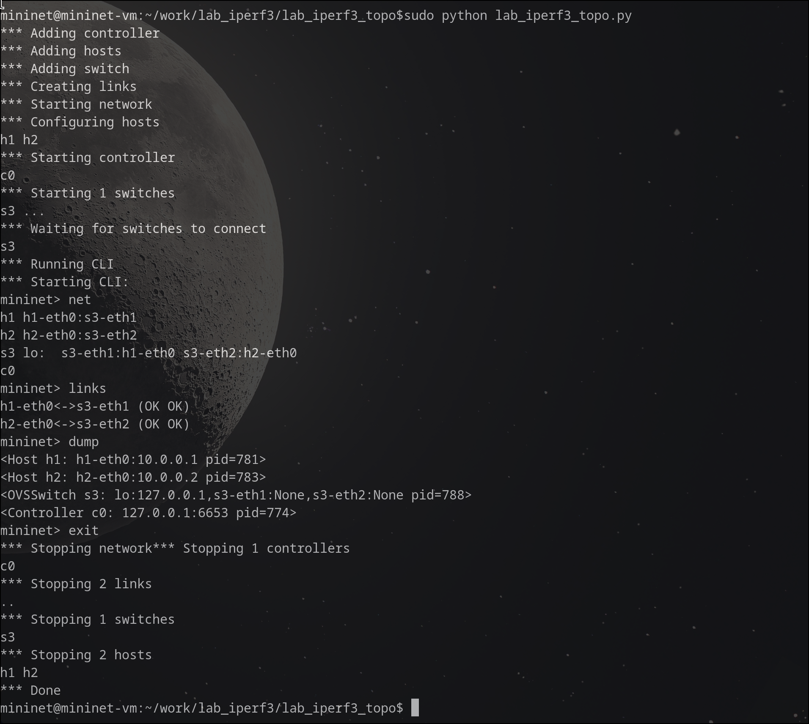


## 3. Вывод информации о хосте h1 
Я добавил строку 
```python 
print( "Host", h1.name, "has IP address", h1.IP(), "andMAC address", h1.MAC() )
``` 
в скрипт.

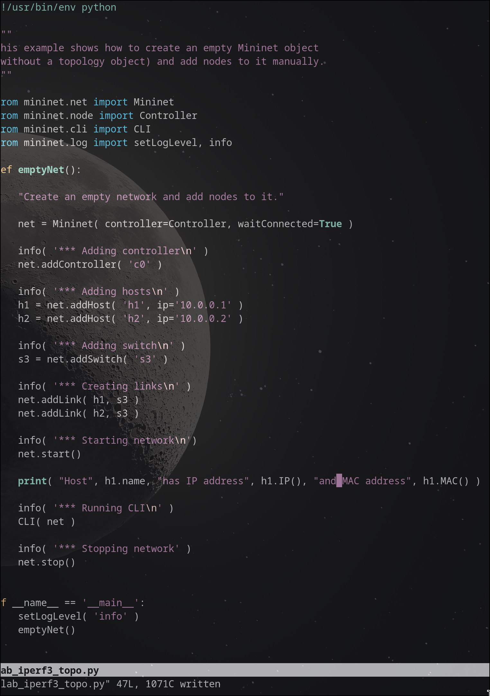


## 4. Проверка работы скрипта

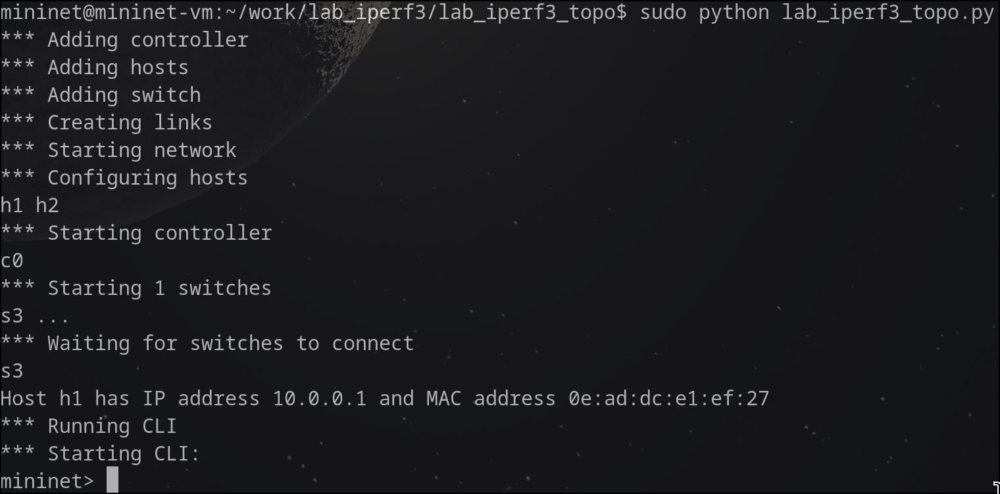


## 5. Вывод информации о втором хосте

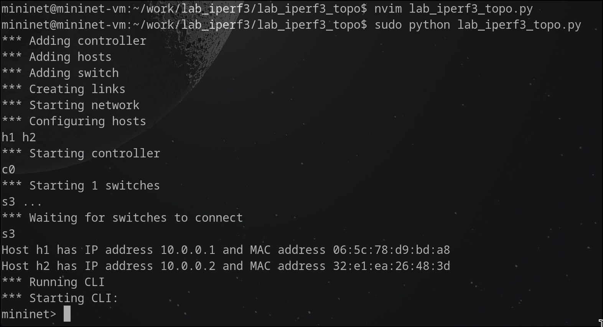

## 6. Настройки параметров производительности

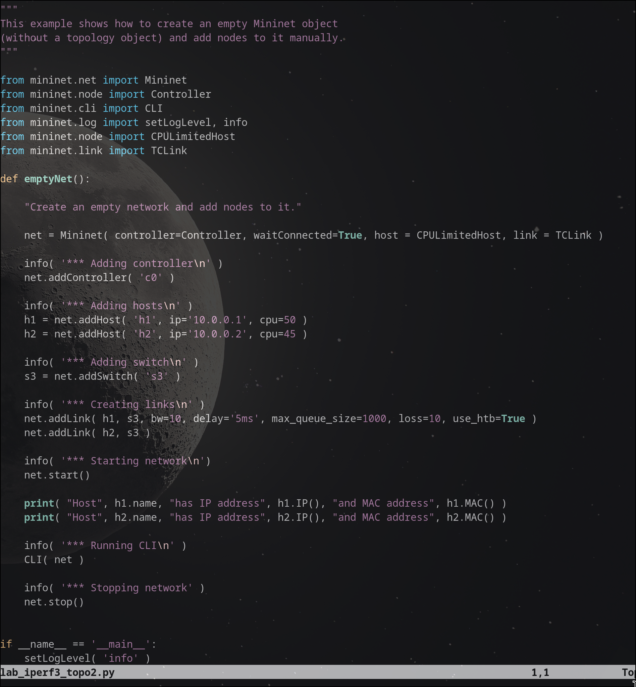 

Можно увидеть, что были ограниченыя процессорные ресурсы на хотсах, а также установлены гранциы размера очереди и задержки на канале между первым хостом и коммутатором.


## 7. Сравнение работы двух скриптов

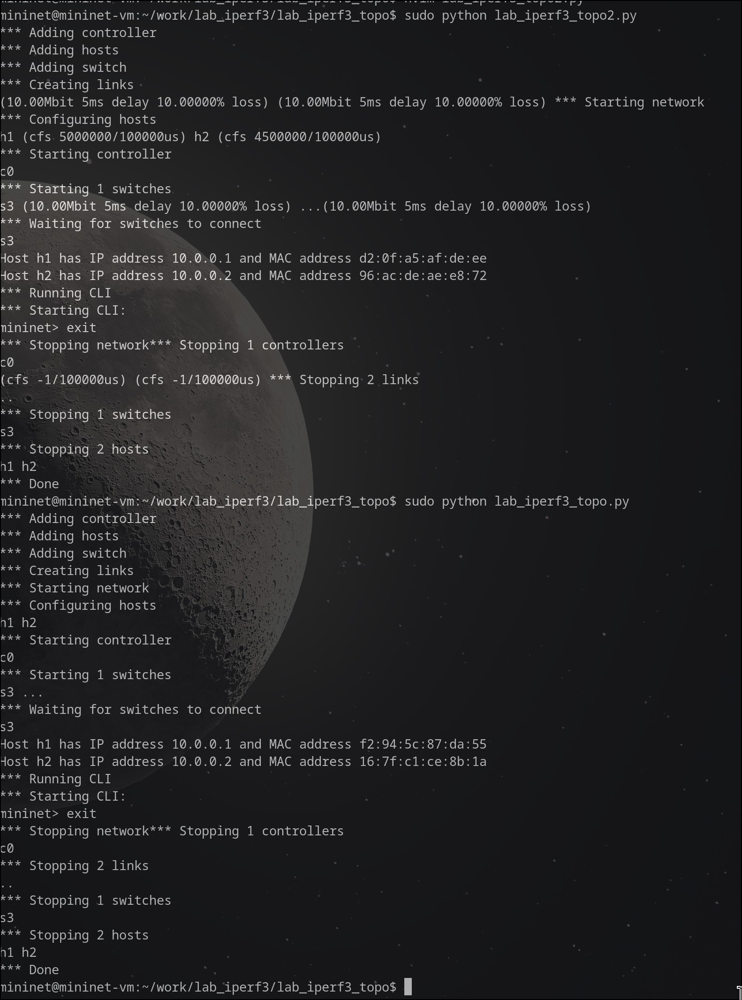


## 8. Создание копии `lab_iperf3_topo2.py`
Я сделал копию скрипта `lab_iperf3_topo2.py` и поместил его в подка-
талог `iperf`.

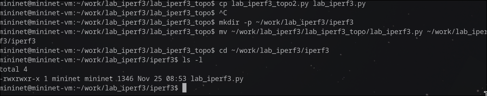


## 9. Модификация `lab_iperf3.py` 

Я изменил код так, чтобы на хостах не было ограничений по ресурсам процессора, задержка между хостами и коммутаторами была 75мс, а пропускная способность 100Мбит/с без ограничений.

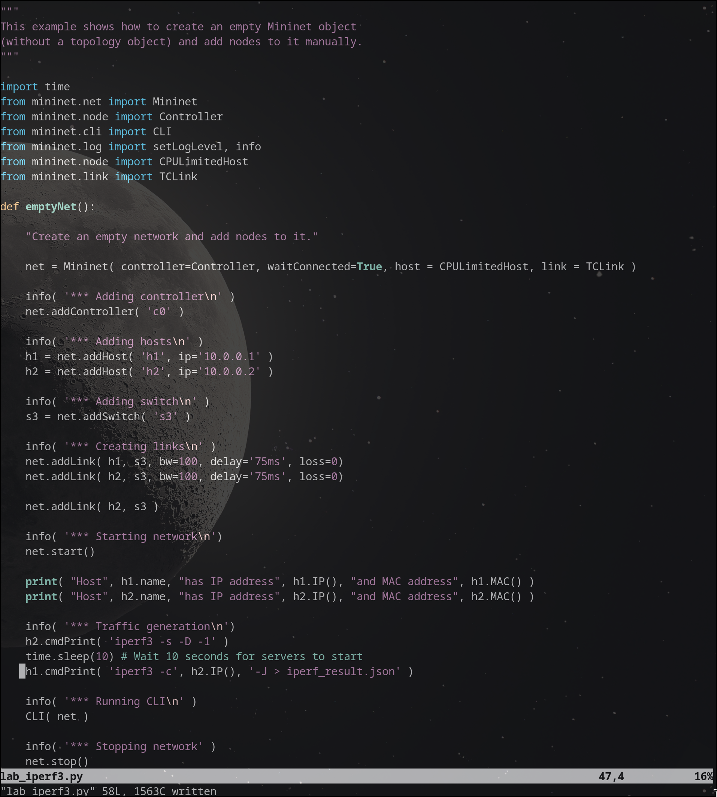


## 10. Запуск iperf3 и построение графиков

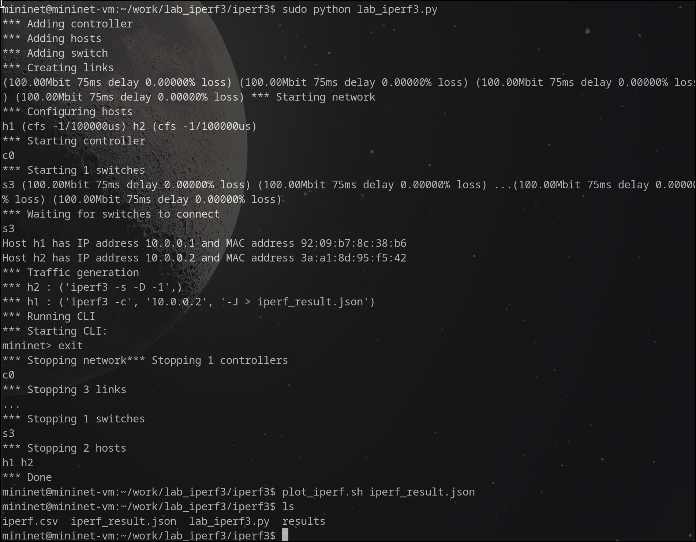


## 12. Создание и проверка Makefile

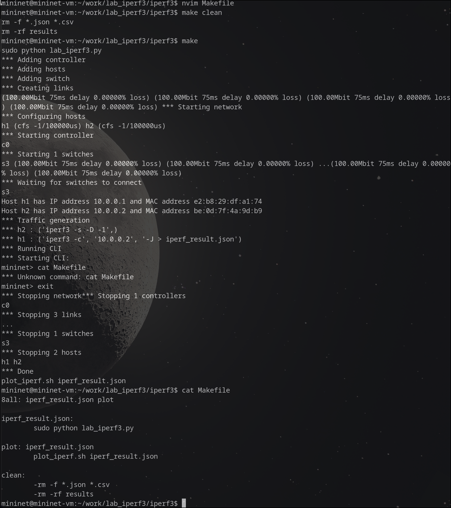


## Графики

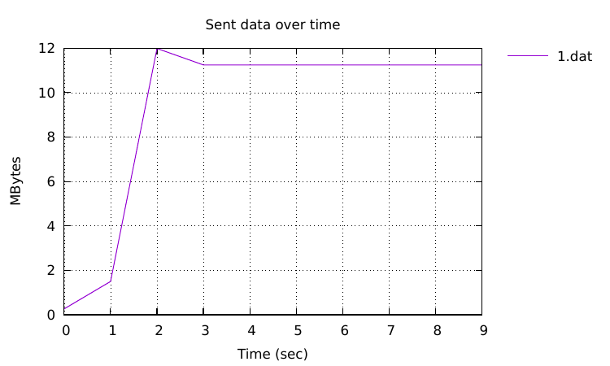

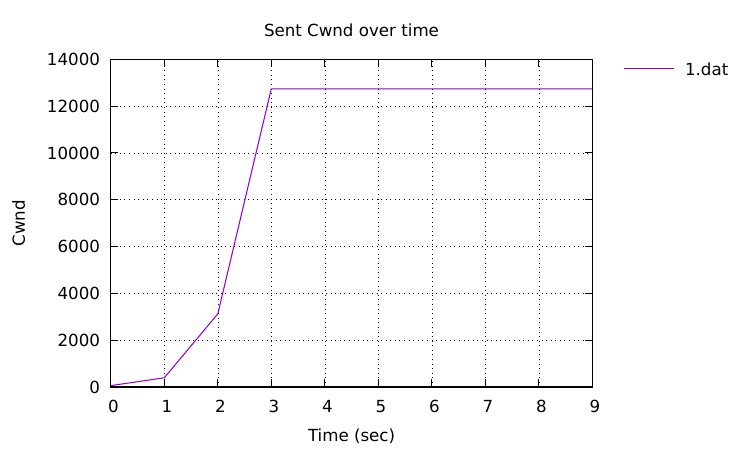


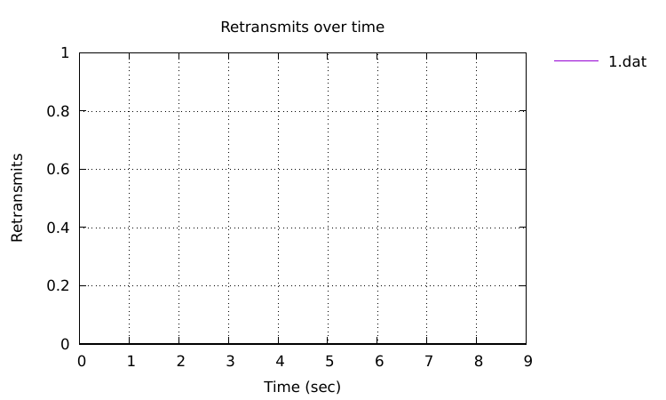

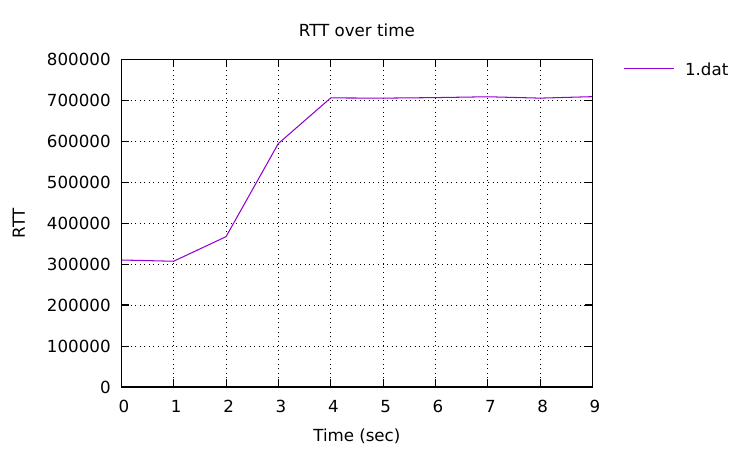

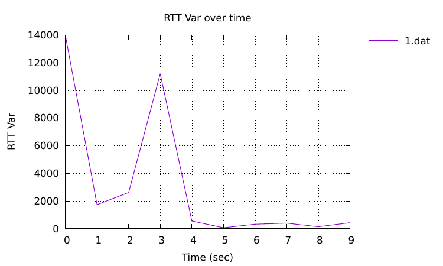

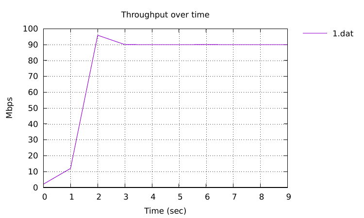


# Выводы
Я познакомился с инструментом для измерения пропускной способности сети в режиме 
реального времени — iPerf3, а также получил навыки проведения воспроизводимого 
эксперимента по измерению пропускной способности моделируемой сети в среде Mininet.

В процессе выполнения работы были решены поставленные задачи, а именно:
1. Воспроизвести посредством API Mininet эксперименты по измерению про-
пускной способности с помощью iPerf3.
2. Построить графики по проведённому эксперименту


# Список литературы{.unnumbered}

