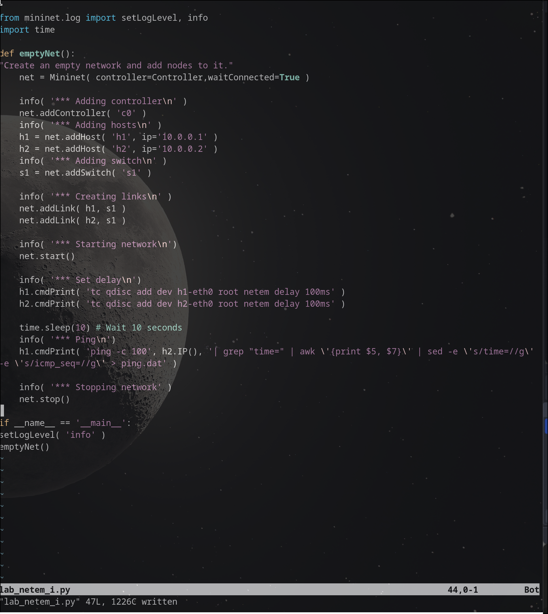

---
## Front matter
lang: ru-RU
title: Лабораторная работа № 4
subtitle: "Эмуляция и измерение задержек в глобальных сетях" 
author:
  - Старовойтов Е. С.
institute:
  - Российский университет дружбы народов, Москва, Россия
date: 5 декабря 2024

## i18n babel
babel-lang: russian
babel-otherlangs: english

## Formatting pdf
toc: false
toc-title: Содержание
slide_level: 2
aspectratio: 169
section-titles: true
theme: metropolis
header-includes:
 - \metroset{progressbar=frametitle,sectionpage=progressbar,numbering=fraction}
---

# Информация

## Докладчик

  * Старовойтов Егор Сергеевич 
  * студент кафедры ТВиК
  * Российский университет дружбы народов
  * [1032212281@pfur.ru](mailto:1032212281@pfur.ru)

# Вводная часть

## Цели и задачи
Основной целью работы является знакомство с NETEM — инструментом для
тестирования производительности приложений в виртуальной сети, а также
получение навыков проведения интерактивного и воспроизводимого экспе-
риментов по измерению задержки и её дрожания (jitter) в моделируемой сети
в среде Mininet.

1. Задайте простейшую топологию, состоящую из двух хостов и коммутатора
с назначенной по умолчанию mininet сетью 10.0.0.0/8.
2. Проведите интерактивные эксперименты по добавлению/изменению задерж-
ки, джиттера, значения корреляции для джиттера и задержки, распределения
времени задержки в эмулируемой глобальной сети.
3. Реализуйте воспроизводимый эксперимент по заданию значения задержки
в эмулируемой глобальной сети. Постройте график.
4. Самостоятельно реализуйте воспроизводимые эксперименты по изменению
задержки, джиттера, значения корреляции для джиттера и задержки, рас-
пределения времени задержки в эмулируемой глобальной сети. Постройте
графики.

## Результаты
Поставленные боевые задачи были выполнены, все цели достигнуты.

# Выполнение лабораторной работы
## 1. Подключение по ssh и выдача прав графическим приложениям

## 2. Терминалы хостов h1 и h2.

## 3. ping (h2 - слева, h1 - справа) 

## 4. ping с установленными задержками

## 5. ping с задержками 50мс

## 6. Удаление задержек

## 7. Дрожание задержки

## 8. Дрожание задержки с вариациями

## 9. Задержки с нормальным распределением

## 10. lab_netem script

## 11. Makefile

## 12. Автоматизированное проведение эксперимента

## Графики

# Выводы

Я познакомился с NETEM — инструментом для
тестирования производительности приложений в виртуальной сети, а также
получение навыков проведения интерактивного и воспроизводимого экспе-
риментов по измерению задержки и её дрожания (jitter) в моделируемой сети
в среде Mininet.
