---
## Front matter
title: "Лабораторная работа № 4"
subtitle: "Эмуляция и измерение задержек в глобальных сетях" 
author: "Старовойтов Егор Сергеевич"

## Generic otions
lang: ru-RU
toc-title: "Содержание"

## Bibliography
bibliography: bib/cite.bib
csl: pandoc/csl/gost-r-7-0-5-2008-numeric.csl

## Pdf output format
toc: true # Table of contents
toc-depth: 2
lof: true # List of figures
lot: true # List of tables
fontsize: 12pt
linestretch: 1.5
papersize: a4
documentclass: scrreprt
## I18n polyglossia
polyglossia-lang:
  name: russian
  options:
	- spelling=modern
	- babelshorthands=true
polyglossia-otherlangs:
  name: english
## I18n babel
babel-lang: russian
babel-otherlangs: english
## Fonts
mainfont: IBM Plex Serif
romanfont: IBM Plex Serif
sansfont: IBM Plex Sans
monofont: IBM Plex Mono
mathfont: STIX Two Math
mainfontoptions: Ligatures=Common,Ligatures=TeX,Scale=0.94
romanfontoptions: Ligatures=Common,Ligatures=TeX,Scale=0.94
sansfontoptions: Ligatures=Common,Ligatures=TeX,Scale=MatchLowercase,Scale=0.94
monofontoptions: Scale=MatchLowercase,Scale=0.94,FakeStretch=0.9
mathfontoptions:
## Biblatex
biblatex: true
biblio-style: "gost-numeric"
biblatexoptions:
  - parentracker=true
  - backend=biber
  - hyperref=auto
  - language=auto
  - autolang=other*
  - citestyle=gost-numeric
## Pandoc-crossref LaTeX customization
figureTitle: "Рис."
tableTitle: "Таблица"
listingTitle: "Листинг"
lofTitle: "Список иллюстраций"
lotTitle: "Список таблиц"
lolTitle: "Листинги"
## Misc options
indent: true
header-includes:
  - \usepackage{indentfirst}
  - \usepackage{float} # keep figures where there are in the text
  - \floatplacement{figure}{H} # keep figures where there are in the text
---

# Цель работы
Основной целью работы является знакомство с NETEM — инструментом для
тестирования производительности приложений в виртуальной сети, а также
получение навыков проведения интерактивного и воспроизводимого экспе-
риментов по измерению задержки и её дрожания (jitter) в моделируемой сети
в среде Mininet.

# Задание
1. Задайте простейшую топологию, состоящую из двух хостов и коммутатора
с назначенной по умолчанию mininet сетью 10.0.0.0/8.
2. Проведите интерактивные эксперименты по добавлению/изменению задерж-
ки, джиттера, значения корреляции для джиттера и задержки, распределения
времени задержки в эмулируемой глобальной сети.
3. Реализуйте воспроизводимый эксперимент по заданию значения задержки
в эмулируемой глобальной сети. Постройте график.
4. Самостоятельно реализуйте воспроизводимые эксперименты по изменению
задержки, джиттера, значения корреляции для джиттера и задержки, рас-
пределения времени задержки в эмулируемой глобальной сети. Постройте
графики.

# Теоретическое введение
NETEM — сетевой эмулятор Linux, используемый для тестирования произ-
водительности реальных клиент-серверных приложений в виртуальной сети.
Виртуальная сеть в данном случае представляет собой лабораторную среду для
воспроизведения поведения глобальной сети (Wide Area Network, WAN). NETEM
позволяет пользователю задать ряд параметров сети, например, задержку, дро-
жание задержки (jitter), уровень потери пакетов, дублирование и изменение
порядка пакетов.
NETEM реализован в Linux и состоит из двух частей: модуля ядра для ор-
ганизации очередей и утилиты командной строки для его настройки. Между
протоколом IP и сетевым устройством создаётся очередь с дисциплиной обслу-
живания. Дисциплина обслуживания очереди реализуется как объект с двумя
интерфейсами. Один интерфейс ставит пакеты в очередь для отправки, а другой
интерфейс отправляет пакеты на сетевое устройство. На основе дисциплины
обслуживания очередей принимается решение о том, какие пакеты отправлять,
какие пакеты задерживать и какие пакеты отбрасывать.
Дисциплины обработки очередей можно разделить на бесклассовые и классо-
вые. Бесклассовые дисциплины, в общем, получают данные, переупорядочивают,
вносят задержку или уничтожают их. Такие дисциплины могут использоватся
для указания ограничений интерфейса целиком, без какого-либо разделения по
классам. Наиболее распространённой бесклассовой дисциплиной является FIFO
(первым пришёл, первым обслужен). В NETEM и в Linux в целом эта дисциплина
обслуживания очереди используется по умолчанию.
Классовые дисциплины широко используются в случаях, когда тот или иной
вид трафика необходимо обрабатывать по разному. Примером классовой дис-
циплины может служить CBQ — Class Based Queueing (дисциплина обработки
очередей на основе классов). Классы трафика организованы в дерево — у каждого
класса есть не более одного родителя; класс может иметь множество потомков.
Классы, которые не имеют родителей, называются корневыми. Классы, которые
не имеют потомков, называются классами-ветками.

# Выполнение лабораторной работы
## 1. Подключение по ssh и выдача прав графическим приложениям

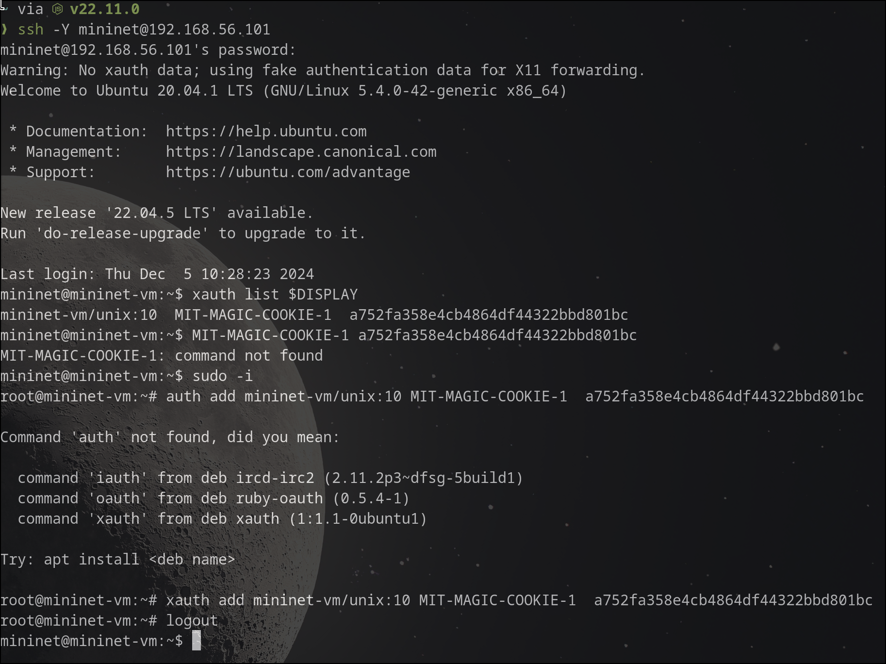

## 2. Терминалы хостов h1 и h2.
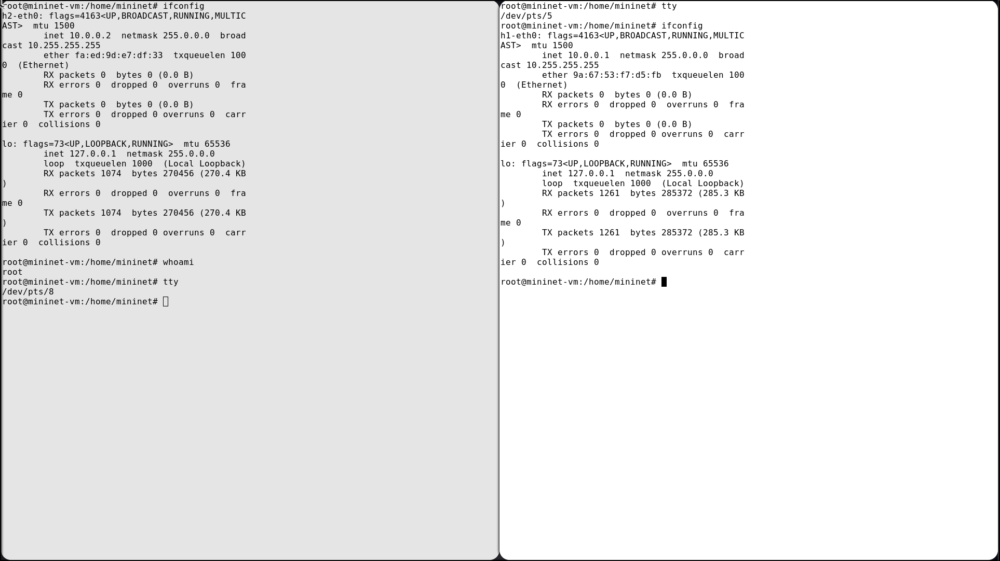

## 3. ping (h2 - слева, h1 - справа) 

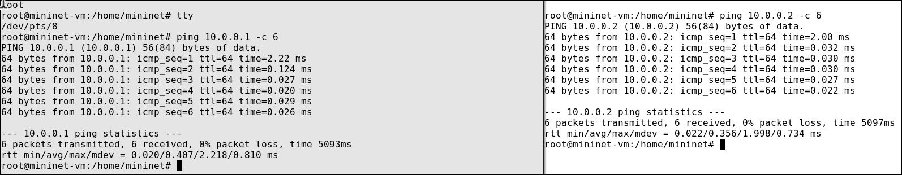

## 4. ping с установленными задержками

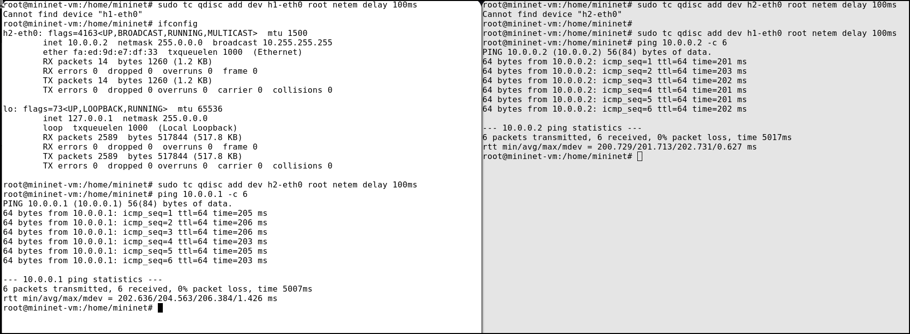

## 5. ping с задержками 50мс

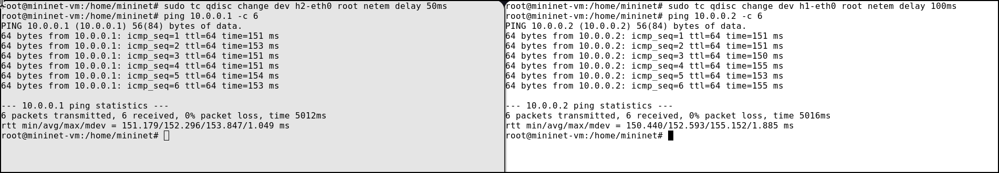

## 6. Удаление задержек

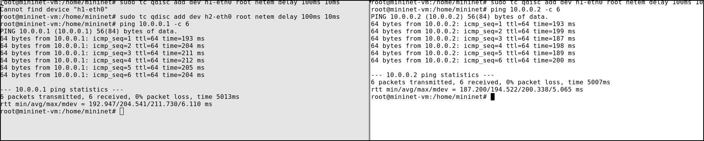

## 7. Дрожание задержки

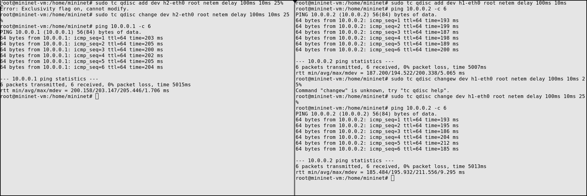

## 8. Дрожание задержки с вариациями

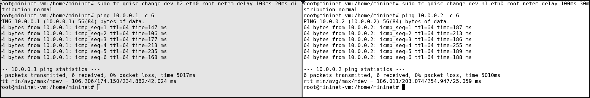

## 9. Задержки с нормальным распределением

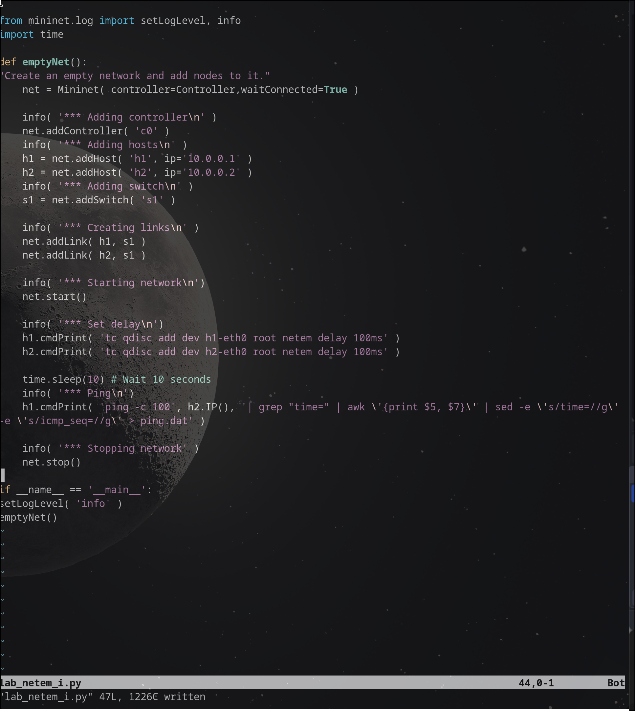

## 10. lab_netem script

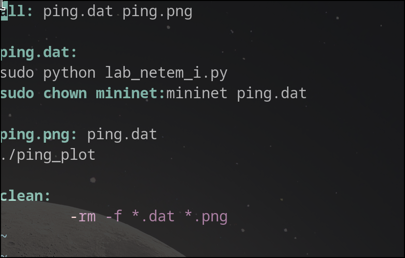

## 11. Makefile

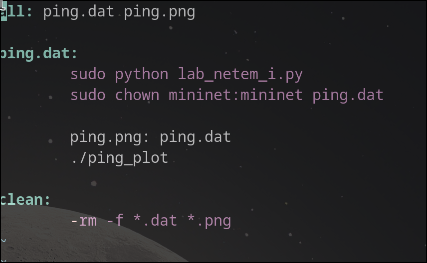

## 12. Автоматизированное проведение эксперимента
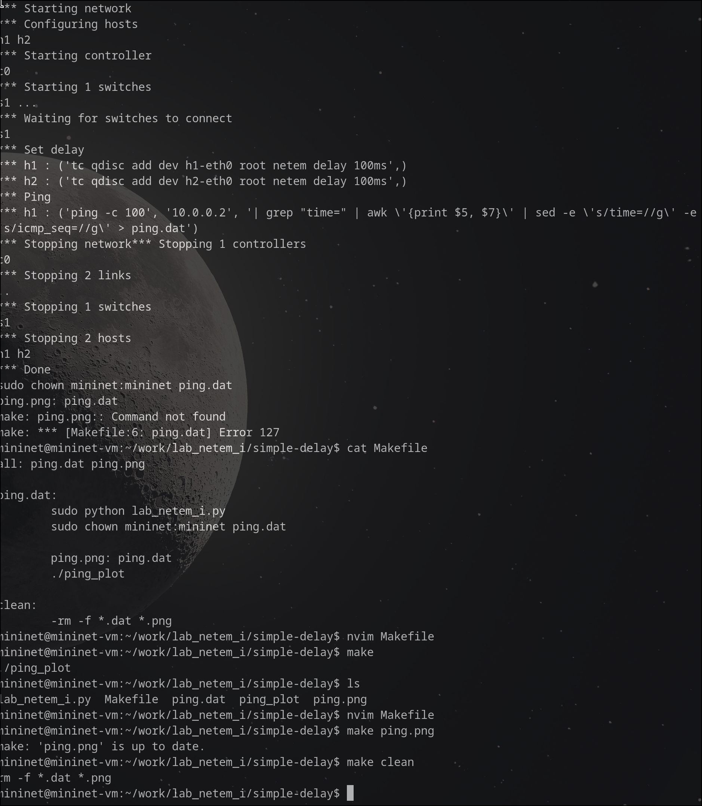

## Графики

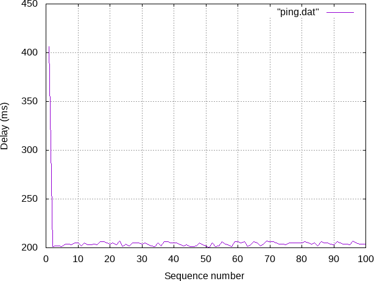

# Выводы
Я познакомился с NETEM — инструментом для
тестирования производительности приложений в виртуальной сети, а также
получение навыков проведения интерактивного и воспроизводимого экспе-
риментов по измерению задержки и её дрожания (jitter) в моделируемой сети
в среде Mininet.

# Список литературы{.unnumbered}

