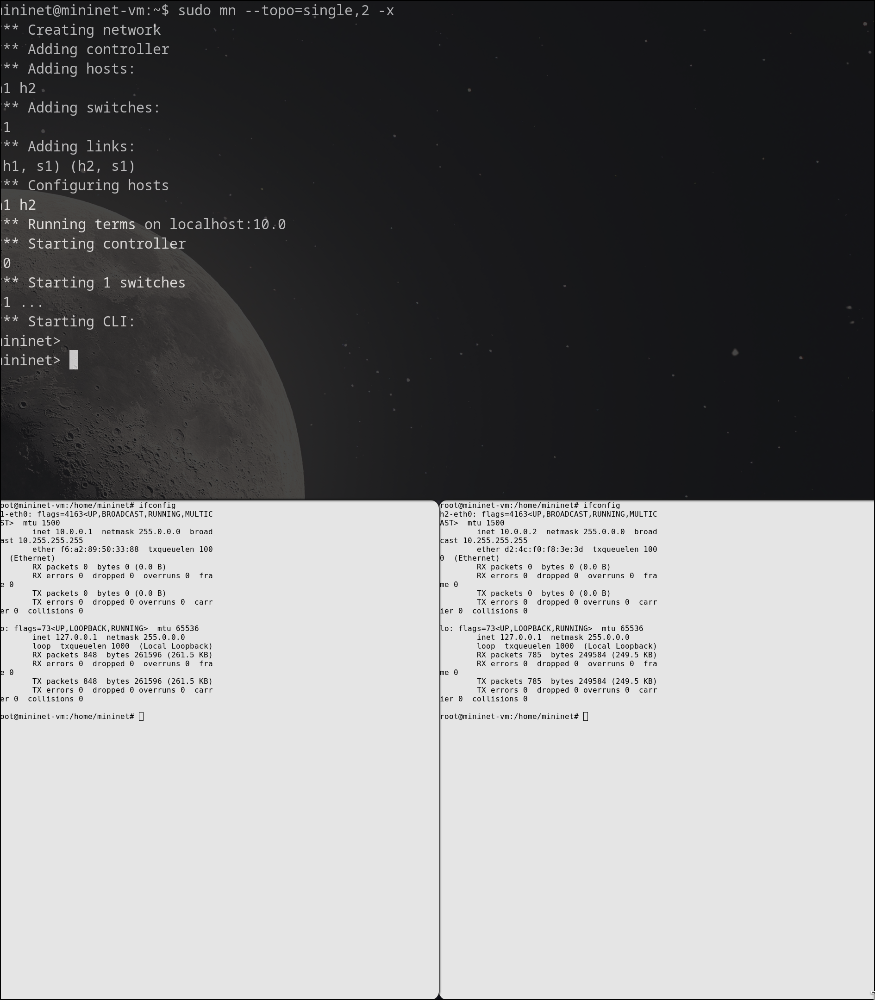

---
## Front matter
lang: ru-RU
title: Лабораторная работа № 5
subtitle: "Эмуляция и измерение потерь пакетов в глобальных сетях" 
author:
  - Старовойтов Е. С.
institute:
  - Российский университет дружбы народов, Москва, Россия
date: 13 декабря 2024

## i18n babel
babel-lang: russian
babel-otherlangs: english

## Formatting pdf
toc: false
toc-title: Содержание
slide_level: 2
aspectratio: 169
section-titles: true
theme: metropolis
header-includes:
 - \metroset{progressbar=frametitle,sectionpage=progressbar,numbering=fraction}
---

# Информация

## Докладчик

  * Старовойтов Егор Сергеевич 
  * студент кафедры ТВиК
  * Российский университет дружбы народов
  * [1032212281@pfur.ru](mailto:1032212281@pfur.ru)

# Вводная часть

## Цели и задачи
Основной целью работы является получение навыков проведения интер-
активных экспериментов в среде Mininet по исследованию параметров сети,
связанных с потерей, дублированием, изменением порядка и повреждением
пакетов при передаче данных. Эти параметры влияют на производительность
протоколов и сетей

1. Задайте простейшую топологию, состоящую из двух хостов и коммутатора
с назначенной по умолчанию mininet сетью 10.0.0.0/8.
2. Проведите интерактивные эксперименты по по исследованию параметров
сети, связанных с потерей, дублированием, изменением порядка и повре-
ждением пакетов при передаче данных.
3. Реализуйте воспроизводимый эксперимент по добавлению правила отбрасы-
вания пакетов в эмулируемой глобальной сети. На экран выведите сводную
информацию о потерянных пакетах.
4. Самостоятельно реализуйте воспроизводимые эксперименты по иссле-
дованию параметров сети, связанных с потерей, изменением порядка и повреждением пакетов при передаче данных. На экран выведите сводную
информацию о потерянных пакетах.

## Результаты
Поставленные боевые задачи были выполнены, все цели достигнуты.

# Выполнение лабораторной работы
## 1. Запуск простейшей топологии 

## 2. Проверка соединения

## 3. Потеря пакетов

## 4. Добавление значения корреляции для потери пакетов в эмулируемой глобальной сети

## 5. Повреждение пакетов

## 6. Переупорядочивание пакетов

## 7. Дублирование пакетов

## 8. Выполнение автоматизированного эксперимента

## 9. lab_netem_ii.py

## 10. Makefile

# Выводы
Я получил навыки проведения интер-
активных экспериментов в среде Mininet по исследованию параметров сети,
связанных с потерей, дублированием, изменением порядка и повреждением
пакетов при передаче данных.

