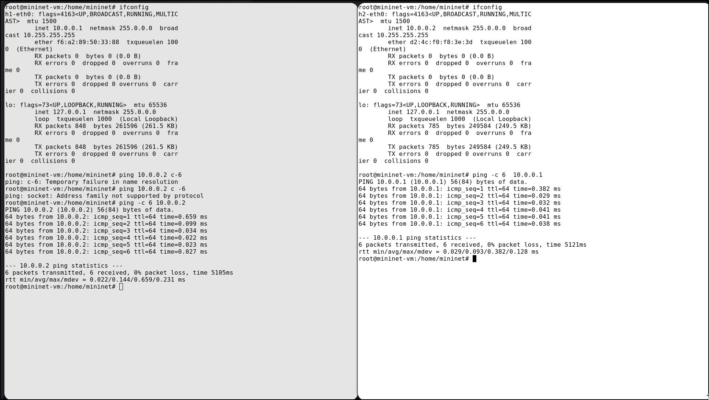

---
## Front matter
title: "Лабораторная работа № 5"
subtitle: "Эмуляция и измерение потерь пакетов в глобальных сетях" 
author: "Старовойтов Егор Сергеевич"

## Generic otions
lang: ru-RU
toc-title: "Содержание"

## Bibliography
bibliography: bib/cite.bib
csl: pandoc/csl/gost-r-7-0-5-2008-numeric.csl

## Pdf output format
toc: true # Table of contents
toc-depth: 2
lof: true # List of figures
lot: true # List of tables
fontsize: 12pt
linestretch: 1.5
papersize: a4
documentclass: scrreprt
## I18n polyglossia
polyglossia-lang:
  name: russian
  options:
	- spelling=modern
	- babelshorthands=true
polyglossia-otherlangs:
  name: english
## I18n babel
babel-lang: russian
babel-otherlangs: english
## Fonts
mainfont: IBM Plex Serif
romanfont: IBM Plex Serif
sansfont: IBM Plex Sans
monofont: IBM Plex Mono
mathfont: STIX Two Math
mainfontoptions: Ligatures=Common,Ligatures=TeX,Scale=0.94
romanfontoptions: Ligatures=Common,Ligatures=TeX,Scale=0.94
sansfontoptions: Ligatures=Common,Ligatures=TeX,Scale=MatchLowercase,Scale=0.94
monofontoptions: Scale=MatchLowercase,Scale=0.94,FakeStretch=0.9
mathfontoptions:
## Biblatex
biblatex: true
biblio-style: "gost-numeric"
biblatexoptions:
  - parentracker=true
  - backend=biber
  - hyperref=auto
  - language=auto
  - autolang=other*
  - citestyle=gost-numeric
## Pandoc-crossref LaTeX customization
figureTitle: "Рис."
tableTitle: "Таблица"
listingTitle: "Листинг"
lofTitle: "Список иллюстраций"
lotTitle: "Список таблиц"
lolTitle: "Листинги"
## Misc options
indent: true
header-includes:
  - \usepackage{indentfirst}
  - \usepackage{float} # keep figures where there are in the text
  - \floatplacement{figure}{H} # keep figures where there are in the text
---

# Цель работы
Основной целью работы является получение навыков проведения интер-
активных экспериментов в среде Mininet по исследованию параметров сети,
связанных с потерей, дублированием, изменением порядка и повреждением
пакетов при передаче данных. Эти параметры влияют на производительность
протоколов и сетей

# Задание
1. Задайте простейшую топологию, состоящую из двух хостов и коммутатора
с назначенной по умолчанию mininet сетью 10.0.0.0/8.
2. Проведите интерактивные эксперименты по по исследованию параметров
сети, связанных с потерей, дублированием, изменением порядка и повре-
ждением пакетов при передаче данных.
3. Реализуйте воспроизводимый эксперимент по добавлению правила отбрасы-
вания пакетов в эмулируемой глобальной сети. На экран выведите сводную
информацию о потерянных пакетах.
4. Самостоятельно реализуйте воспроизводимые эксперименты по иссле-
дованию параметров сети, связанных с потерей, изменением порядка и повреждением пакетов при передаче данных. На экран выведите сводную
информацию о потерянных пакетах.

# Теоретическое введение
В дополнение к задержке многие глобальные и локальные сети подвержены
потере, переупорядочению, повреждению и дублированию пакетов.
Потеря пакета — состояние, возникающее, когда пакет, проходящий через
сеть, не достигает пункта назначения. Потеря пакетов может иметь большое
влияние на сети с высокой пропускной способностью и высокой задержкой.
Распространенной причиной потери пакетов является неспособность марш-
рутизаторов удерживать пакеты, поступающие со скоростью, превышающей
скорость отправления. Даже в тех случаях, когда высокая скорость поступления
пакетов носит временный характер (например, кратковременные всплески тра-
фика), маршрутизатор ограничен объёмом буферной памяти, используемой для
мгновенного хранения пакетов. Когда происходит потеря пакетов, протокол TCP
уменьшает окно перегрузки и, следовательно, пропускную способность вдвое.
Переупорядочивание пакетов — условие, возникающее, когда пакеты при-
нимаются в порядке, отличном от того, в котором они были отправлены.
Переупорядочивание пакетов (неупорядоченная доставка пакетов) обычно
является результатом того, что пакеты следуют по разным маршрутам для до-
стижения пункта назначения. Переупорядочивание пакетов может ухудшить
пропускную способность TCP-соединений в сетях с высокой пропускной способ-
ностью и высокой задержкой. Для каждого сегмента, полученного не по порядку,
получатель TCP отправляет подтверждение (ACK) для последнего правильно
принятого сегмента. Как только отправитель TCP получает три подтверждения
для одного и того же сегмента (тройной дубликат ACK), отправитель считает,
что получатель неправильно принял пакет, следующий за пакетом, который
подтверждается три раза. Затем он продолжает уменьшать окно перегрузки
и пропускную способность наполовину.

# Выполнение лабораторной работы
## 1. Запуск простейшей топологии 

## 2. Проверка соединения

## 3. Потеря пакетов

## 4. Добавление значения корреляции для потери пакетов в эмулируемой глобальной сети

## 5. Повреждение пакетов

## 6. Переупорядочивание пакетов

## 7. Дублирование пакетов

## 8. Выполнение автоматизированного эксперимента

## 9. lab_netem_ii.py

## 10. Makefile

# Выводы
Я получил навыки проведения интер-
активных экспериментов в среде Mininet по исследованию параметров сети,
связанных с потерей, дублированием, изменением порядка и повреждением
пакетов при передаче данных.

# Список литературы{.unnumbered}

