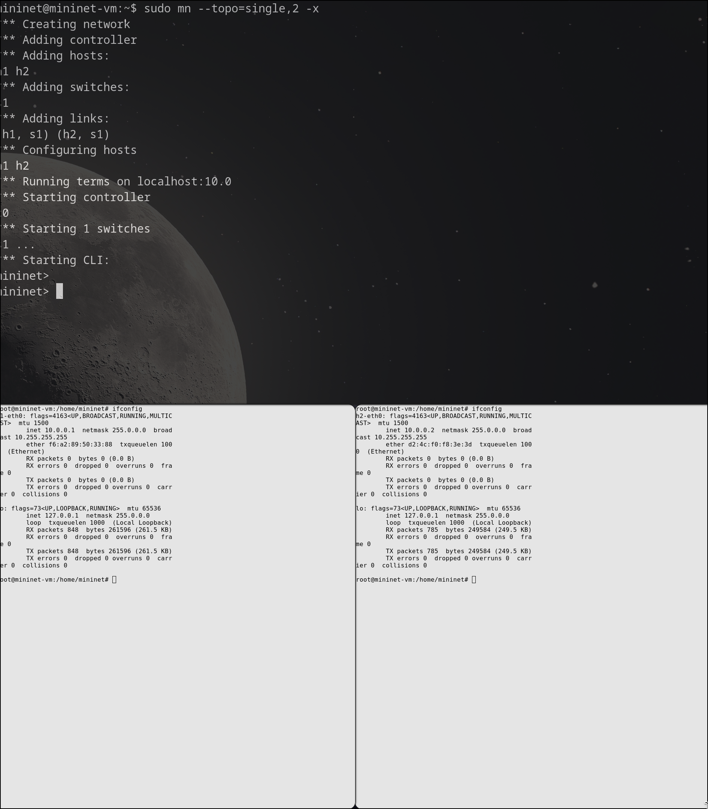
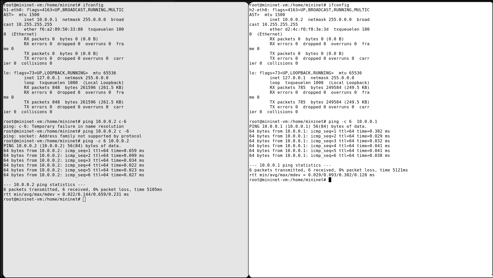
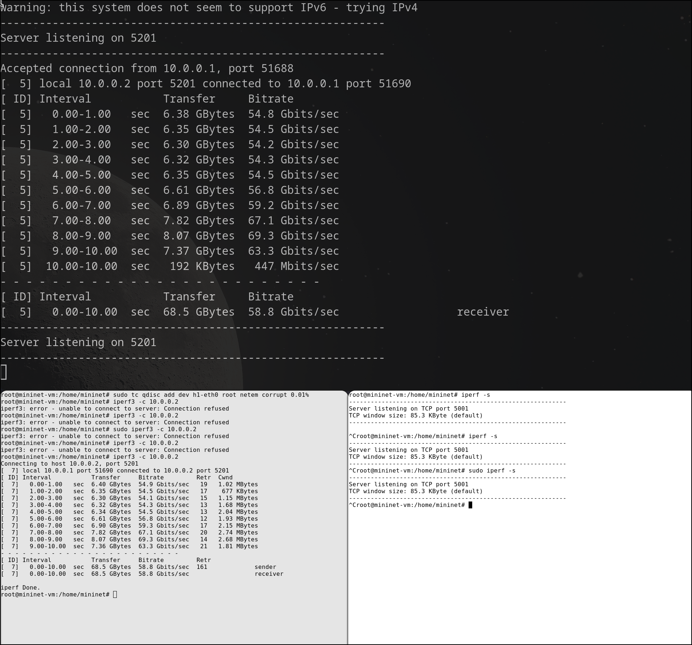
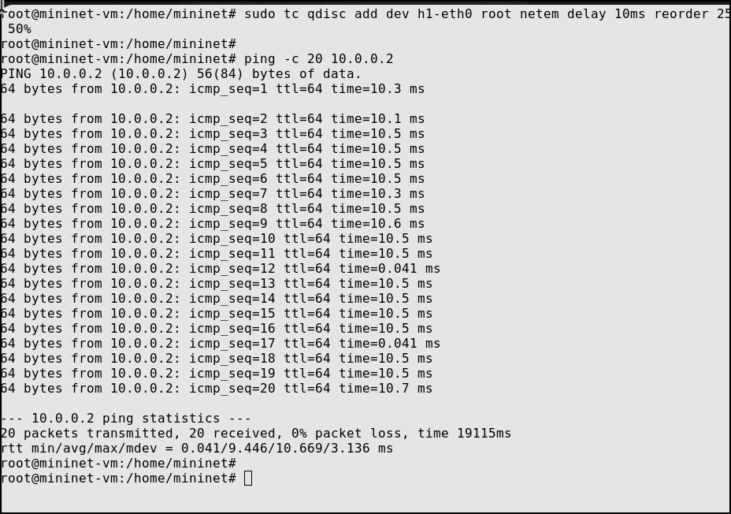

---
## Front matter
lang: ru-RU
title: Лабораторная работа № 6
subtitle: "Настройка пропускной способности глобальной сети с помощью Token Bucket Filter" 
author:
  - Старовойтов Е. С.
institute:
  - Российский университет дружбы народов, Москва, Россия
date: 19 декабря 2024

## i18n babel
babel-lang: russian
babel-otherlangs: english

## Formatting pdf
toc: false
toc-title: Содержание
slide_level: 2
aspectratio: 169
section-titles: true
theme: metropolis
header-includes:
 - \metroset{progressbar=frametitle,sectionpage=progressbar,numbering=fraction}
---

# Информация

## Докладчик

  * Старовойтов Егор Сергеевич 
  * студент кафедры ТВиК
  * Российский университет дружбы народов
  * [1032212281@pfur.ru](mailto:1032212281@pfur.ru)

# Вводная часть

## Цели и задачи
Основной целью работы является знакомство с принципами работы дисци-
плины очереди Token Bucket Filter, которая формирует входящий/исходящий
трафик для ограничения пропускной способности, а также получение навыков
моделирования и исследования поведения трафика посредством проведения
интерактивного и воспроизводимого экспериментов в Mininet

1. Задайте топологию (рис. 6.3), состоящую из двух хостов и двух коммутаторов
с назначенной по умолчанию mininet сетью 10.0.0.0/8.
2. Проведите интерактивные эксперименты по ограничению пропускной спо-
собности сети с помощью TBF в эмулируемой глобальной сети.

## Результаты
Поставленные боевые задачи были выполнены, все цели достигнуты.

# Выполнение лабораторной работы
## 1. Запуск топологии, проверка соединения между хостами

## 2. iperf без ограничений скорости передачи данныx

## 3. Ограничение скорости на конечных хостах

## 4. Ограничение на коммутаторах (test iperf3)

## 5. Настрйока ограничения на коммутаторе

## 6. NETEM & TBF

# Выводы
Я познакомился с принципами работы дисциплины очереди Token Bucket Filter, которая формирует входящий/исходящий
трафик для ограничения пропускной способности, а также получил навыки
моделирования и исследования поведения трафика посредством проведения
интерактивного и воспроизводимого экспериментов в Mininet

