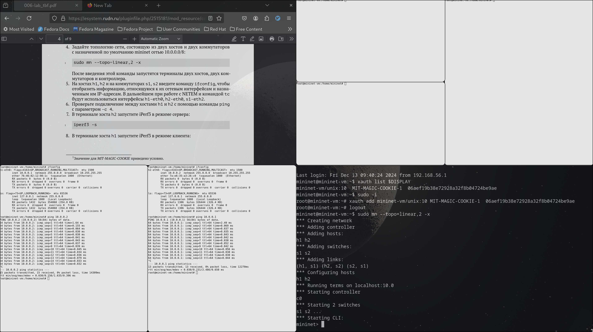
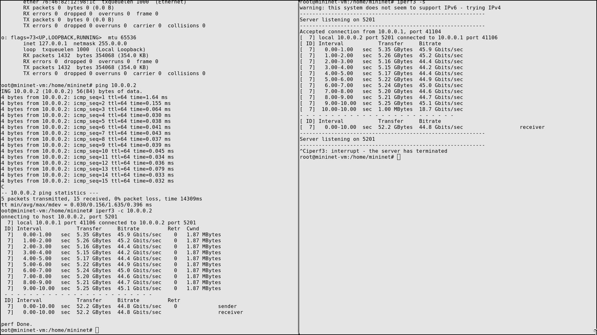
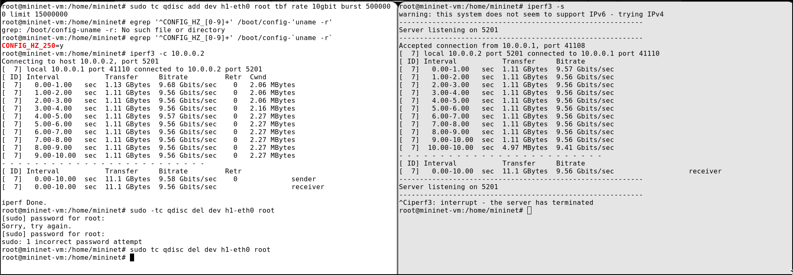
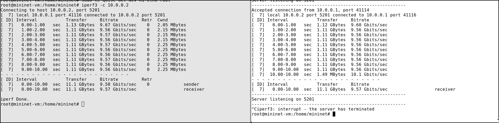
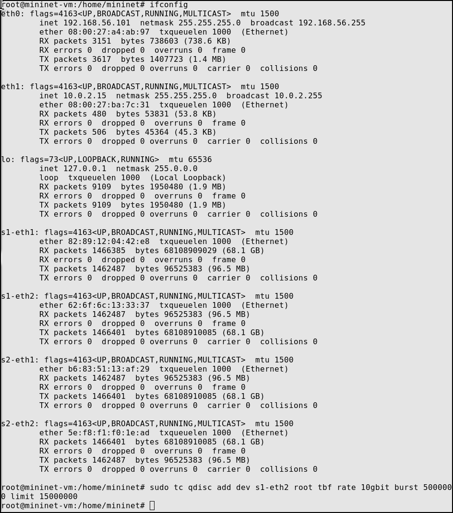
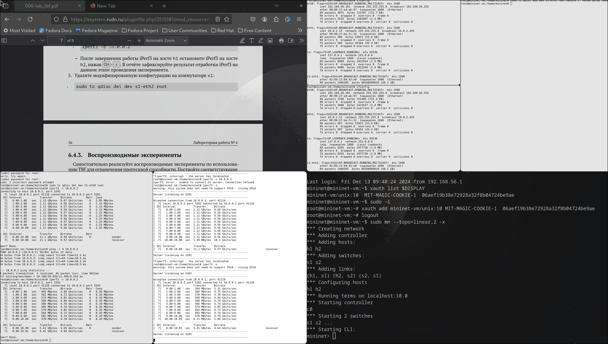

---
## Front matter
title: "Лабораторная работа № 6"
subtitle: "Настройка пропускной способности глобальной сети с помощью Token Bucket Filter" 
author: "Старовойтов Егор Сергеевич"

## Generic otions
lang: ru-RU
toc-title: "Содержание"

## Bibliography
bibliography: bib/cite.bib
csl: pandoc/csl/gost-r-7-0-5-2008-numeric.csl

## Pdf output format
toc: true # Table of contents
toc-depth: 2
lof: true # List of figures
lot: true # List of tables
fontsize: 12pt
linestretch: 1.5
papersize: a4
documentclass: scrreprt
## I18n polyglossia
polyglossia-lang:
  name: russian
  options:
	- spelling=modern
	- babelshorthands=true
polyglossia-otherlangs:
  name: english
## I18n babel
babel-lang: russian
babel-otherlangs: english
## Fonts
mainfont: IBM Plex Serif
romanfont: IBM Plex Serif
sansfont: IBM Plex Sans
monofont: IBM Plex Mono
mathfont: STIX Two Math
mainfontoptions: Ligatures=Common,Ligatures=TeX,Scale=0.94
romanfontoptions: Ligatures=Common,Ligatures=TeX,Scale=0.94
sansfontoptions: Ligatures=Common,Ligatures=TeX,Scale=MatchLowercase,Scale=0.94
monofontoptions: Scale=MatchLowercase,Scale=0.94,FakeStretch=0.9
mathfontoptions:
## Biblatex
biblatex: true
biblio-style: "gost-numeric"
biblatexoptions:
  - parentracker=true
  - backend=biber
  - hyperref=auto
  - language=auto
  - autolang=other*
  - citestyle=gost-numeric
## Pandoc-crossref LaTeX customization
figureTitle: "Рис."
tableTitle: "Таблица"
listingTitle: "Листинг"
lofTitle: "Список иллюстраций"
lotTitle: "Список таблиц"
lolTitle: "Листинги"
## Misc options
indent: true
header-includes:
  - \usepackage{indentfirst}
  - \usepackage{float} # keep figures where there are in the text
  - \floatplacement{figure}{H} # keep figures where there are in the text
---

# Цель работы
Основной целью работы является знакомство с принципами работы дисци-
плины очереди Token Bucket Filter, которая формирует входящий/исходящий
трафик для ограничения пропускной способности, а также получение навыков
моделирования и исследования поведения трафика посредством проведения
интерактивного и воспроизводимого экспериментов в Mininet

# Задание
1. Задайте топологию (рис. 6.3), состоящую из двух хостов и двух коммутаторов
с назначенной по умолчанию mininet сетью 10.0.0.0/8.
2. Проведите интерактивные эксперименты по ограничению пропускной спо-
собности сети с помощью TBF в эмулируемой глобальной сети.

# Теоретическое введение
Token Bucket Filter (TBF) представляет собой алгоритм, используемый в сетях
с коммутацией пакетов для ограничения пропускной способности и пиковой
нагрузки трафика (рис. 6.1). Передача поступающих в очередь системы (queque)
пакетов данных осуществляется при наличии в специальном буфере (bucket)
необходимого числа разрешений на передачу (или токенов). Токены могут быть
представлены в виде пакетов или числа байтов, поступающих в буфер (корзину)
фиксированного размера с фиксированной скоростью

# Выполнение лабораторной работы
## 1. Запуск топологии, проверка соединения между хостами

## 2. iperf без ограничений скорости передачи данныx

## 3. Ограничение скорости на конечных хостах

## 4. Ограничение на коммутаторах (test iperf3)

## 5. Настрйока ограничения на коммутаторе

## 6. NETEM & TBF

# Вывод
Я познакомился с принципами работы дисциплины очереди Token Bucket Filter, которая формирует входящий/исходящий
трафик для ограничения пропускной способности, а также получил навыки
моделирования и исследования поведения трафика посредством проведения
интерактивного и воспроизводимого экспериментов в Mininet

# Список литературы{.unnumbered}

